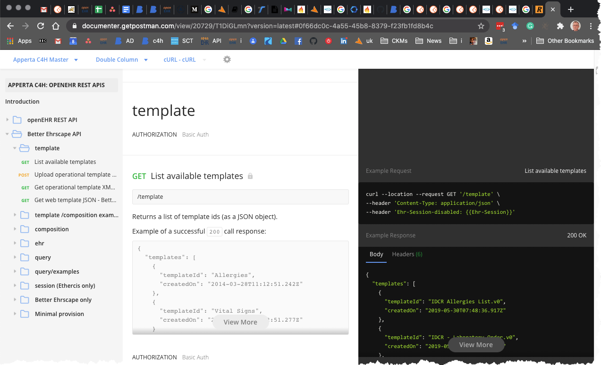

# Overview

This set of documentation will introduce you to some of the principles behind openEHR and how to start working with the APIs and data formats that the various openEHR CDRs (Clinical Data Repositories) support.

#### Postman 

We strongly recommend that you orientate yourselves using the free Postman tool, as this will let you easily play with the various API calls without writing any code. Once you understand the principles it will be much easier to write code for your own environment, and better still, Postman can often generate code examples in a variety of languages.

To make life easier, we have prepared a `Postman collection` which is essentially a pre-cooked set of openEHR API calls, for which when used with Postman environment files, can be used to point very quickly at an endpoint and get playing.

Click the 'Run Postman Button' to import the Postman 'Apperta C4H openEHR REST APIs' collection and the associated Postman environment..

Documentation for the Postman collection is [here](https://documenter.getpostman.com/view/20729/T1DiGLmn)

### Which API to use?

For more information on the various APIs  see [Overview of the different CDR APIs](intro/INT2-overview-rest-apis.md).

To get started we suggest you focus on the Better Ehrscape API. Although this is proprietary to Better and will soon be supplanted by the openEHR REST API, it uses some simplified data formats that can make life much easier. These formats are being adopted by the wider CDR community as part of the openEHR CDR API, so this advice will change, once this is better established.

In other respects the Better API is conceptually very similar and you will not find it hard to adjust to the openEHR REST API, indeed one possibility is to use the standard API for most calls.

### Key content

[Getting started with Postman and the openEHR REST collection](postman/PM1-postman-getting-ready.md)

[Introduction to openEHR](intro/INT1-overview-openehr.md)

[Overview of the different CDR APIs](intro/INT2-overview-rest-apis.md)

[Working with the Better Ehrscape API](cdr/ehrscape/ECDR1-authentication.md)

[Working with the openEHR REST API](cdr/openehr/OCDR1-authentication.md)

