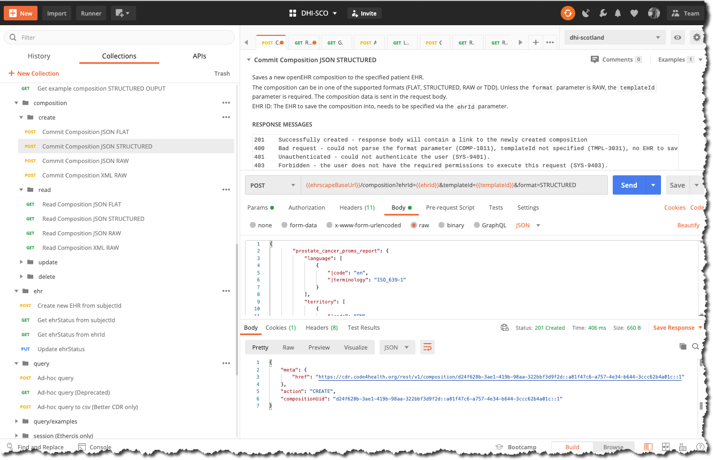

# Committing openEHR data

All data committed to an openEHR CDR is done so via a `POST /composition` call - as a JSON or XML 'blob'. 

As it is committed, the data will be validated against both the appropriate openEHR template and the underlying Reference Model schema.

If the data is valid, it will be stored in the CDR and is allocated a unique `compositionID`, which is returned by the POST /composition call on a successful call.

This section will submit an example Composition to the CDR by running a `POST /composition - Commit composition` call.

A number of data serialisation options can be used. In this case we will use the Better `STRUCTURED JSON` format, as it is somewhat easier to use than the current openEHR `CANONICAL JSON` format.

#### Better Ehrscape: `POST /composition - Commit Composition STRUCTURED'

##### Parameters

**`ehrId`**:   
This is is the internal CDR identifier for a specific patient. When a patient is registered with the CDR,an EHR object is created with a unique `ehr_id` identifier, and is associated with an external `subjectId` and subjectNamespace e.g an NHS Number, CHI number, or a local hospital number.

We will find out how to work out the correct `ehrId` for a patient in a future section.

Generally when you first open a patient record session, you will retrieve their `ehrId` via their `subjectID` and `subjectNamespace`. We will explain how to do that in the next section.

For testing purposes, you should use a known `ehrId`. If you have a Postman environment file, an example will be in there, otherwise you can find out how to identify valid ehrIds [here](ECDR5-retrieving-an-ehrId.md)

**`templateId`**:  
This is the identifier of the openEHR template, against which you need to validate the composition, in this case `DHI - Urology_PROMs-v0`  

**`format`**:  
This defines the format of JSON or XML that you are sending. Use `STRUCTURED` for this example.

    
##### Request

=== "Postman"
    

=== "cURL" 
    ```bash

        curl --location \
        --request POST '{{cdr.ehrscapeBaseUrl}}/v1/composition?ehrId=3e674739-950c-4b8a-976b-5aef21c618c5&templateId=DHI%20-%20Urology_PROMs-v0&format=STRUCTURED' \
        --header 'Content-Type: application/json' \
        --header 'Authorization: {{cdr.authToken}}' \
        --data-raw '{
       {
        "prostate_cancer_proms_report": {
            "language": [
                {
                    "|code": "en",
                    "|terminology": "ISO_639-1"
                }
            ],
            "territory": [
                {
                    "|code": "EN",
                    "|terminology": "ISO_3166-1"
                }
            ],
            "context": [
                {
                    "xds_metadata": [
                        {
                            "document_type": [
                                "Patient recorded outcome measures"
                            ]
                        }
                    ],
                    "start_time": [
                        "2020-07-05T13:32:56.186Z"
                    ],
                    "setting": [
                        {
                            "|code": "238",
                            "|value": "other care",
                            "|terminology": "openehr"
                        }
                    ]
                }
            ],
             "what_matters_to_me": [
                    {
                        "what_matters_to_me": [
                        "Parents",
                        "Mood",
                        "Isolation",
                        "Eating",
                        "Family",
                        "Safety"
                        ]
                    }
                    ],
            "howru_score": [ {
                "pain_or_discomfort": [
                    {
                        "|code": "at0041",
                        "|value": "slight",
                        "|ordinal": 1
                    }
                ],
                "feeling_low_or_worried": [
                    {
                        "|code": "at0042",
                        "|value": "quite a lot",
                        "|ordinal": 2
                    }
                ],
                "limited_in_what_i_can_do": [
                    {
                        "|code": "at0041",
                        "|value": "slight",
                        "|ordinal": 1
                    }
                ],
                "dependent_on_others": [
                    {
                        "|code": "at0043",
                        "|value": "extreme",
                        "|ordinal": 3
                    }
                ],
                "summary_score": [
                    4
                ],
                "time": [
                    "2020-07-21T15:41:54.175Z"
                ],
                "language": [
                    {
                        "|code": "en",
                        "|terminology": "ISO_639-1"
                    }
                ],
                "encoding": [
                    {
                        "|code": "UTF-8",
                        "|terminology": "IANA_character-sets"
                    }
                ]
            }
        ], 
  
            "eortc_qlq-c30": [
             
                        {
                            "trouble_doing_strenuous_activities": [
                                {
                                    "|code": "at0007",
                                    "|value": "Quite a bit",
                                    "|ordinal": 3
                                }
                            ],
                            "trouble_taking_a_long_walk": [
                                {
                                    "|code": "at0040",
                                    "|value": "Quite a bit",
                                    "|ordinal": 3
                                }
                            ],
                            "trouble_taking_a_short_walk_outside_of_the_house": [
                                {
                                    "|code": "at0044",
                                    "|value": "Quite a bit",
                                    "|ordinal": 3
                                }
                            ],
                            "need_to_stay_in_bed_or_a_chair_during_the_day": [
                                {
                                    "|code": "at0049",
                                    "|value": "Very much",
                                    "|ordinal": 4
                                }
                            ],
                            "need_help_with_eating_dressing_washing_yourself_or_using_the_toilet": [
                                {
                                    "|code": "at0051",
                                    "|value": "A little",
                                    "|ordinal": 2
                                }
                            ],
                            "during_the_past_week_were_limited_in_doing_either_work_or_other_daily_activities": [
                                {
                                    "|code": "at0056",
                                    "|value": "Quite a bit",
                                    "|ordinal": 3
                                }
                            ],
                            "during_the_past_week_were_limited_in_pursuing_hobbies_or_other_leisure_time_activities": [
                                {
                                    "|code": "at0060",
                                    "|value": "Quite a bit",
                                    "|ordinal": 3
                                }
                            ],
                            "during_the_past_week_had_short_of_breath": [
                                {
                                    "|code": "at0064",
                                    "|value": "Quite a bit",
                                    "|ordinal": 3
                                }
                            ],
                            "during_the_past_week_had_pain": [
                                {
                                    "|code": "at0067",
                                    "|value": "A little",
                                    "|ordinal": 2
                                }
                            ],
                            "during_the_past_week_need_to_rest": [
                                {
                                    "|code": "at0072",
                                    "|value": "Quite a bit",
                                    "|ordinal": 3
                                }
                            ],
                            "during_the_past_week_had_trouble_sleeping": [
                                {
                                    "|code": "at0076",
                                    "|value": "Quite a bit",
                                    "|ordinal": 3
                                }
                            ],
                            "during_the_past_week_felt_weak": [
                                {
                                    "|code": "at0078",
                                    "|value": "Not at all",
                                    "|ordinal": 1
                                }
                            ],
                            "during_the_past_week_lacked_appetite": [
                                {
                                    "|code": "at0084",
                                    "|value": "Quite a bit",
                                    "|ordinal": 3
                                }
                            ],
                            "during_the_past_week_felt_nauseated": [
                                {
                                    "|code": "at0086",
                                    "|value": "Not at all",
                                    "|ordinal": 1
                                }
                            ],
                            "during_the_past_week_had_vomited": [
                                {
                                    "|code": "at0090",
                                    "|value": "Not at all",
                                    "|ordinal": 1
                                }
                            ],
                            "during_the_past_week_have_been_constipated": [
                                {
                                    "|code": "at0097",
                                    "|value": "Very much",
                                    "|ordinal": 4
                                }
                            ],
                            "during_the_past_week_had_diarrhea": [
                                {
                                    "|code": "at0099",
                                    "|value": "A little",
                                    "|ordinal": 2
                                }
                            ],
                            "during_the_past_week_were_tired": [
                                {
                                    "|code": "at0102",
                                    "|value": "Not at all",
                                    "|ordinal": 1
                                }
                            ],
                            "during_the_past_week_pain_interfere_with_daily_activities": [
                                {
                                    "|code": "at0109",
                                    "|value": "Very much",
                                    "|ordinal": 4
                                }
                            ],
                            "during_the_past_week_had_difficulty_in_concentrating": [
                                {
                                    "|code": "at0110",
                                    "|value": "Not at all",
                                    "|ordinal": 1
                                }
                            ],
                            "during_the_past_week_felt_tense": [
                                {
                                    "|code": "at0115",
                                    "|value": "A little",
                                    "|ordinal": 2
                                }
                            ],
                            "during_the_past_week_were_worried": [
                                {
                                    "|code": "at0121",
                                    "|value": "Very much",
                                    "|ordinal": 4
                                }
                            ],
                            "during_the_past_week_felt_irritable": [
                                {
                                    "|code": "at0123",
                                    "|value": "A little",
                                    "|ordinal": 2
                                }
                            ],
                            "during_the_past_week_felt_depressed": [
                                {
                                    "|code": "at0128",
                                    "|value": "Quite a bit",
                                    "|ordinal": 3
                                }
                            ],
                            "during_the_past_week_had_difficulty_remembering_things": [
                                {
                                    "|code": "at0133",
                                    "|value": "Very much",
                                    "|ordinal": 4
                                }
                            ],
                            "during_the_past_week_physical_condition_or_medical_treatment_interfered_with_family_life": [
                                {
                                    "|code": "at0135",
                                    "|value": "A little",
                                    "|ordinal": 2
                                }
                            ],
                            "during_the_past_week_physical_condition_or_medical_treatment_interfered_with_social_activities": [
                                {
                                    "|code": "at0138",
                                    "|value": "Not at all",
                                    "|ordinal": 1
                                }
                            ],
                            "during_the_past_week_physical_condition_or_medical_treatment_caused_financial_difficulties": [
                                {
                                    "|code": "at0143",
                                    "|value": "A little",
                                    "|ordinal": 2
                                }
                            ],
                            "rate_overall_health_during_the_past_week": [
                                {
                                    "|code": "at0147",
                                    "|value": "2",
                                    "|ordinal": 2
                                }
                            ],
                            "rate_overall_quality_of_life_during_the_past_week": [
                                {
                                    "|code": "at0157",
                                    "|value": "5",
                                    "|ordinal": 5
                                }
                            ],
                            "total_score": [
                                61
                            ],
                            "time": [
                                "2020-07-15T16:47:06.320Z"
                            ],
                    "language": [
                        {
                            "|code": "en",
                            "|terminology": "ISO_639-1"
                        }
                    ],
                    "encoding": [
                        {
                            "|code": "UTF-8",
                            "|terminology": "IANA_character-sets"
                        }
                    ]
                }
            ],
            "i-pss_prostate_score": [
                {
                    "a1._incomplete_emptying": [
                        {
                            "|code": "at0015",
                            "|value": "Less Than 1 Time In 5",
                            "|ordinal": 1
                        }
                    ],
                    "a2._frequency": [
                        {
                            "|code": "at0016",
                            "|value": "Less Than Half The Time",
                            "|ordinal": 2
                        }
                    ],
                    "a3._intermittency": [
                        {
                            "|code": "at0017",
                            "|value": "About Half The Time",
                            "|ordinal": 3
                        }
                    ],
                    "a4._urgency": [
                        {
                            "|code": "at0017",
                            "|value": "About Half The Time",
                            "|ordinal": 3
                        }
                    ],
                    "a5._weak_stream": [
                        {
                            "|code": "at0016",
                            "|value": "Less Than Half The Time",
                            "|ordinal": 2
                        }
                    ],
                    "a6._straining": [
                        {
                            "|code": "at0018",
                            "|value": "More Than Half The Time",
                            "|ordinal": 4
                        }
                    ],
                    "a7._nocturia": [
                        {
                            "|code": "at0060",
                            "|value": "3 times",
                            "|ordinal": 3
                        }
                    ],
                    "total_i-pss_score": [
                        18
                    ],
                    "i-pss_score_grade": [
                        {
                            "|code": "at0087",
                            "|value": "8-19 Moderate",
                            "|terminology": "local"
                        }
                    ],
                    "time": [
                        "2020-07-05T13:32:56.186Z"
                    ],
                    "language": [
                        {
                            "|code": "en",
                            "|terminology": "ISO_639-1"
                        }
                    ],
                    "encoding": [
                        {
                            "|code": "UTF-8",
                            "|terminology": "IANA_character-sets"
                        }
                    ]
                }
            ],
            "category": [
                {
                    "|code": "433",
                    "|value": "event",
                    "|terminology": "openehr"
                }
            ],
            "composer": [
                {
                    "|name": "John Smith"
                }
            ]
        }
    }'
    ```
=== "NodeJS/Axios"
    ```js
        var axios = require('axios');

        var data = JSON.stringify({"prostate_cancer_proms_report": // trimmed for brevity}");

        var config = {
         method: 'post',
         url: '{{cdr.ehrscapeBaseUrl}}/v1/composition?ehrId=3e674739-950c-4b8a-976b-5aef21c618c5&templateId=DHI - Urology_PROMs-v0&format=STRUCTURED',
        headers: { 
            'Content-Type': 'application/json', 
            'Authorization': '{{cdr.authToken}}', 
                data : data
                };

        axios(config)
        .then(function (response) {
        console.log(JSON.stringify(response.data));
        })
        .catch(function (error) {
        console.log(error);
        });

    ```
=== "Python/requests"
        ```python
        import requests

        url = "{{cdr.ehrscapeBaseUrl}}/v1/composition?ehrId=3e674739-950c-4b8a-976b-5aef21c618c5&templateId=DHI - Urology_PROMs-v0&format=STRUCTURED"
   
        payload = "{\n    \"prostate_cancer_proms_report\": {\n              \"composer\": [\n              {\n                  \"|name\": \"John Smith\"\n              }\n          ]\n      }\n TRIMMED for BREVITY }"
        headers = {
        'Content-Type': 'application/json',
        'Authorization': '{{cdr.authToken}}',
        }

        response = requests.request("POST", url, headers=headers, data = payload)

        print(response.text.encode('utf8'))
    ```

##### Response
```json
{
    "meta": {
        "href": "{{cdr.ehrscapeBaseUrl}}/v1/composition/59e8f5a2-6fb6-47d5-9acd-ae6309d0f1dd::a81f47c6-a757-4e34-b644-3ccc62b4a01c::1"
    },
    "action": "CREATE",
    "compositionUid": "59e8f5a2-6fb6-47d5-9acd-ae6309d0f1dd::a81f47c6-a757-4e34-b644-3ccc62b4a01c::1"
}
```

A successful commit will give a `200` response code. 

If the JSON is incorrectly formatted or there is a data validation error, you will get an error message. Interpreting validation error messages can be quite challenging for those new to openEHR, so we will cover this in a separate section later.

!!! tip "The `Composition Id` and versioning"

    The `compositionId` (sometimes `uid` or `compositionUid`) is the unique identifier allocated to (and held within) every composition stored within the CDR.

    You will see that it ends in `...::1`. The `1` is the version of this composition instance. If you need to update the instance (perhaps because of an error), you need to do so via a PUT / composition call and if successful the composition version number will clock up to `::2`.

    In essence every commit is versioned and retained for medico-legal reasons.

    **Initial version**  
    `2cf04d6c-31e8-4599-a14b-9a0add4de5d9::fivium.ehrscape.com::1`

    **Revised version**  
    `2cf04d6c-31e8-4599-a14b-9a0add4de5d9::fivium.ehrscape.com::2`

    If you need to retrieve a composition, it is normally ok to simply use
    the root part `2cf04d6c-31e8-4599-a14b-9a0add4de5d9` which will return
    the latest revision in the current repository.

    Similarly, when a composition is deleted, this is a *logical delete* and the composition can always be retrieved, though is not normally accessible via querying.

We will go through the process of [updating a composition](ECDR6-updating-a-composition.md), via a `PUT /composition` call later.

For now let's just [retrieve the composition](ECDR4-retrieving-a-composition.md) we just committed, via the `GET /composition` call.


