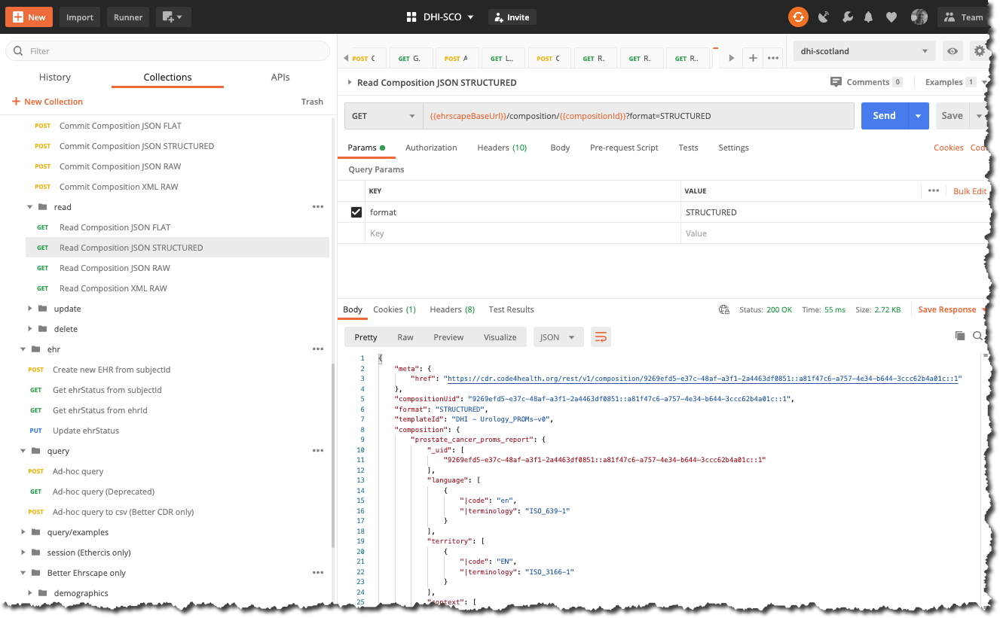

# Retrieving an openEHR Composition

All data committed to an openEHR CDR is done so via a POST or PUT /composition call - as a JSON or XML 'blob'. 

This section will cover how to retrieve a previously stored Composition by running a `GET / composition` call.

A number of data serialisation options, can be used on retrieval. In this case we will ask for the Better `STRUCTURED JSON` format, as this is what we used when committing the composition, but you can commit and retrieve using different formats if you wish.

#### Ehrscape GET /composition example

##### Parameters

`compositionId`: 

This is is the composition UID for the composition you wish to retrieve. Don't worry about how we find that out for now. Just use the UID for the composition you just committed in the last section. 

We will find out how to find compositionIds in a subsequent section.

`format`:

This defines the format of JSON or XML that you are requesting. Use `STRUCTURED` for this example.

## A. Retrieve an openEHR Composition (`STRUCTURED JSON`)

=== "Postman"
    
=== "cURL" 
    ```bash
        curl --location --request GET '{{cdr.ehrscapeBaseUrl}}/composition/{{compositionId}}?format=STRUCTURED' \
      --header 'Content-Type: application/json' \
      --header 'Authorization: {{authToken}}'
    ```

=== "NodeJS/Axios"
    ```js

      var axios = require('axios');

      var config = {
        method: 'get',
        url: '{{cdr.ehrscapeBaseUrl}}/composition/{{compositionId}}?format=STRUCTURED',
        headers: { 
          'Content-Type': 'application/json', 
          'Authorization': '{{authToken}}'
        }
      };

      axios(config)
      .then(function (response) {
        console.log(JSON.stringify(response.data));
      })
      .catch(function (error) {
        console.log(error);
      });
    ```
=== "Python/requests"
    ```python

      import requests

      url = "{{cdr.ehrscapeBaseUrl}}/composition/{{compositionId}}?format=STRUCTURED"

      payload = {}
      headers = {
        'Content-Type': 'application/json',
        'Authorization': '{{authToken}}'
      }

      response = requests.request("GET", url, headers=headers, data = payload)

      print(response.text.encode('utf8'))

    ```

#### Response

If the composition is found a `200` code will be returned along with the composition object , which you will note now includes the uid, but should otherwise be identical to that which you previously submitted.

```json
  {
    "meta": {
        "href": "{{cdr.ehrscapeBaseUrl}}/v1/composition/e921fde4-3800-44c7-b39a-e2c8769a9c1d::a81f47c6-a757-4e34-b644-3ccc62b4a01c::1"
    },
    "compositionUid": "e921fde4-3800-44c7-b39a-e2c8769a9c1d::a81f47c6-a757-4e34-b644-3ccc62b4a01c::1",
    "format": "STRUCTURED",
    "templateId": "DHI - Urology_PROMs-v0",
    "composition": {
        "prostate_cancer_proms_report": {
            "_uid": [
                "e921fde4-3800-44c7-b39a-e2c8769a9c1d::a81f47c6-a757-4e34-b644-3ccc62b4a01c::1"
            ]
            // ..... Snipped for brevity
            "composer": [
                {
                    "|name": "John Smith"
                }
            ]
        }
    },
    "deleted": false,
    "lastVersion": true,
    "ehrId": "3e674739-950c-4b8a-976b-5aef21c618c5",
    "lifecycleState": "COMPLETE"
}
```

!!!tip "Other data formats"

    The Better Ehrscape API offers several other serialisation formats. You can have a look at these by simply changing the `format` parameter on the `GET / composition` call, and the call Header `Accept` to switch between JSON and XML.


    ##### 'FLAT JSON'

    This uses the same path-shortening mechanism as structured JSON but flattens all of the tree structure to a set of name-value pairs. Some developers prefer this to the STRUCTURED format.

    ```
    format=FLAT
    Accept : `application/json'

    ```
    ##### 'RAW JSON'

    This is very similar to, but not identical to the openEHR Canonical JSON format, which essentially supersedes it. It very closely adheres to the openEHR Reference model specification but is pretty voluminous.

    ```
    format=RAW
    Accept : `application/json'
    ```

    ##### 'RAW XML'

    This is 'canonical' openEHR XML which is also accepted by the openEHR REST  API. It is the lingu-franca for all openEHR CDRs, even those which do not support the REST CDR API, will normally accept and expose data in this XML format. 

    ```
    format=RAW
    Accept : `application/xml'
    ```

