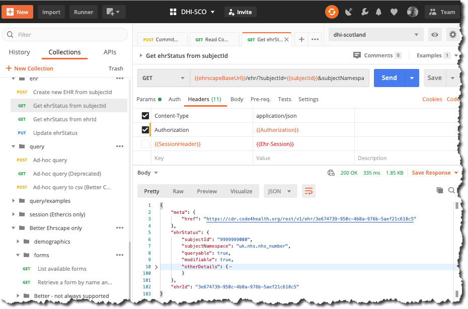

# Retrieving the patient's ehrId 

When a patient is registered with a CDR, by supplying their '`subjectId` (normally a real-word identifier like an NHS number, CHI number or hospital MRI), a top-level `EHR` object is created in the datastore along with a unique identifier for that patient.

Most of the CDR API calls require an `ehrId` to identify the correct patient ,so normally the first activity required if interacting with a patient record is to retrieve their `ehrId`.

!!! hint

    The only datapoint you really need to retrieve is `ehrId`.
     You want to consider caching this for the session, so that it can be used for a number of subsequent calls.


### Better Ehrscape: `GET /ehr - Get ehrStatus from SubjectId`

##### Parameters

###### `subjectId`:

This is the external identifier by which the patient is known within the CDR. It is normally a real-word identifier like an NHS number, CHI number or Hospital 'MRI' number, and will have been supplied to the CDR when the patients' `EHR` object was created in the datastore.

Example value : `9999999000`

###### `subjectNamespace`:

This is just a unique string used to identify the numbering scheme used for the `subjectId`. It will commonly be some sort of URI such as `uk.nhs.nhs_number` and will have been agreed at national level.

Example value : `uk.nhs.nhs_number`


=== "Postman"
    

=== "cURL"
    ```bash
        curl --location \
        --request GET '{{cdr.ehrscapeBaseUrl}}/ehr/?subjectId=9999999000&subjectNamespace=uk.nhs.nhs_number' \
        --header 'Content-Type: application/json' \
        --header 'Authorization: {{cdr.authToken}}'
    ```

=== "NodeJs - Axios"
    ```js
      var axios = require('axios');

        var config = {
        method: 'get',
        url: ' {{cdr.ehrscapeBaseUrl}}/v1/ehr/?subjectId=9999999000&subjectNamespace=uk.nhs.nhs_number',
        headers: { 
            'Content-Type': 'application/json', 
            'Authorization': '{{cdr.authToken}}'
        }
        };

        axios(config)
        .then(function (response) {
        console.log(JSON.stringify(response.data));
        })
        .catch(function (error) {
        console.log(error);
        });
    ```

=== "Python/requests"
    ```python
    import requests

    url = "{{cdr.ehrscapeBaseUrl}}/ehr/?subjectId=9999999000&subjectNamespace=uk.nhs.nhs_number"

    payload = {}
    headers = {
    'Content-Type': 'application/json',
    'Authorization': '{{cdr.authToken}}',
    }

    response = requests.request("GET", url, headers=headers, data = payload)

    print(response.text.encode('utf8'))
    ```

#### Response


Better CDR will give a `200` response code and this structure.

```json
{
    "meta": {
        "href": "https://cdr.code4health.org/rest/v1/ehr/3e674739-950c-4b8a-976b-5aef21c618c5"
    },
    "ehrStatus": {
        "subjectId": "9999999000",
        "subjectNamespace": "uk.nhs.nhs_number",
        "queryable": true,
        "modifiable": true,
        "otherDetails": {
            "@class": "ITEM_TREE",
            "items": [
                {
                    "@class": "CLUSTER",
                    "archetype_details": {
                        "@class": "ARCHETYPED",
                        "archetype_id": {
                            "@class": "ARCHETYPE_ID",
                            "value": "openEHR-EHR-CLUSTER.person_anonymised_parent.v1"
                        },
                        "rm_version": "1.0.1"
                    },
                    "archetype_node_id": "openEHR-EHR-CLUSTER.person_anonymised_parent.v1",
                    "items": [
                        {
                            "@class": "ELEMENT",
                            "name": {
                                "@class": "DV_TEXT",
                                "value": "Administrative Gender"
                            },
                            "archetype_node_id": "at0001",
                            "value": {
                                "@class": "DV_CODED_TEXT",
                                "value": "Male",
                                "defining_code": {
                                    "@class": "CODE_PHRASE",
                                    "terminology_id": {
                                        "@class": "TERMINOLOGY_ID",
                                        "value": "local"
                                    },
                                    "code_string": "at0009"
                                }
                            }
                        },
                        {
                            "@class": "ELEMENT",
                            "name": {
                                "@class": "DV_TEXT",
                                "value": "Birth Sex"
                            },
                            "archetype_node_id": "at0002",
                            "value": {
                                "@class": "DV_CODED_TEXT",
                                "value": "Male",
                                "defining_code": {
                                    "@class": "CODE_PHRASE",
                                    "terminology_id": {
                                        "@class": "TERMINOLOGY_ID",
                                        "value": "local"
                                    },
                                    "code_string": "at0009"
                                }
                            }
                        },
                        {
                            "@class": "ELEMENT",
                            "name": {
                                "@class": "DV_TEXT",
                                "value": "Vital Status"
                            },
                            "archetype_node_id": "at0003",
                            "value": {
                                "@class": "DV_CODED_TEXT",
                                "value": "Alive",
                                "defining_code": {
                                    "@class": "CODE_PHRASE",
                                    "terminology_id": {
                                        "@class": "TERMINOLOGY_ID",
                                        "value": "local"
                                    },
                                    "code_string": "at0004"
                                }
                            }
                        },
                        {
                            "@class": "ELEMENT",
                            "name": {
                                "@class": "DV_TEXT",
                                "value": "Birth Year"
                            },
                            "archetype_node_id": "at0014",
                            "value": {
                                "@class": "DV_DATE",
                                "value": "1944"
                            }
                        }
                    ]
                }
            ]
        }
    },
    "ehrId": "3e674739-950c-4b8a-976b-5aef21c618c5"
}
```


