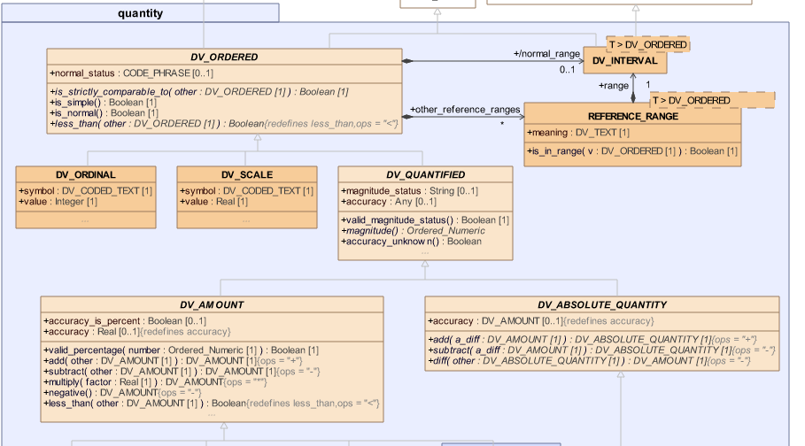

# Querying the ReSPECT form.

Access a patient record from an openEHR CDR that simulates the National Digital Platform (NDP-CDR), identify the current ReSPECT form, and query for some limited information for display in the PHR app (Cohesion). It is assumed that the original form has been submitted to the NDP-CDR by the [NDP ReSPECT app](https://nds.nes.digital/blog/digital-respect-what-s-in-an-interface/)


The initial proposed dataset is
- the uid of the ReSPECT composition
- the date last committed and status and author name
- the clinical leads responsible for the form.
- The patient preferences.
- the clinical recommendation, including the specific CPR (resuscitation) decision

!!! important "Exact query dataset to be finalised"

    The exact dataset may change pending discussion with McMillan


### Querying an openEHR CDR - Archetype Query language (AQL)

a CDR can be best thought of in terms of a exposing a complex object tree with the `EHR` object at the top, `Compositions` objects handling commits, but where **all** of the information in the tree can be traversed and accessed. Conceptually this is a logical query/graph language like SPARQL, the key difference being that the exact paths to the objects you might need to access are defined in the archetypes and templates you use to define and validate the data.

AQL can be written by hand but is normally done using a tool like the Better Studio 

Understanding AQL is not generally important for third-party developers. Normally the correct AQL will be supplied by the CDR owner, indeed in production, it is much more likely that server-side stored queries would be used.

### DHI Respect query

This example will retrieve the data requirement above. 

```sql
SELECT c/uid/value as compositionUid,
       t/data[at0001]/items[at0003]/value/value as cprDecision,
       t/data[at0001]/items[at0002]/value/value as cprDecisionDate,
       g/data[at0001]/items[at0002,'What I most value']/value/value as whatIMostValue,
       g/data[at0001]/items[at0002,'What I most fear']/value/value as whatIMostFear,
       g/data[at0001]/items[openEHR-EHR-CLUSTER.respect_care_priority_scale.v0]/items[at0001]/value/items[at0001]/value as myPriorityScale,
       r/data[at0001]/items[at0002]/value/value as clinicalFocus,
       r/data[at0001]/items[at0003]/value/value as clinicalGuidance,
       h/protocol[at0015]/items[openEHR-EHR-CLUSTER.practitioner_cc.v0,'Signing clinician']/items[openEHR-EHR-CLUSTER.practitioner_role_cc.v0]/items[at0007,'Designation']/value/items[at0007,'Designation']/value/value as signingClinicanRole,
       h/protocol[at0015]/items[openEHR-EHR-CLUSTER.practitioner_cc.v0,'Signing clinician']/items[openEHR-EHR-CLUSTER.name_cc.v0]/items[at0009]/value/items[at0009]/value/value as signingClinicanName,
       r/data[at0001]/items[at0003]/value as clinicalGuidance
FROM EHR e[ehr_id/value = '{{ehrId}}']
CONTAINS 
    COMPOSITION c[openEHR-EHR-COMPOSITION.report.v1]
CONTAINS 
    (EVALUATION t[openEHR-EHR-EVALUATION.cpr_decision_uk.v0] 
    or EVALUATION g[openEHR-EHR-EVALUATION.about_me.v0] 
    or ACTION h[openEHR-EHR-ACTION.service.v0] 
    or EVALUATION r[openEHR-EHR-EVALUATION.recommendation.v1])  
WHERE c/name/value='ReSPECT_v3-6-7'
ORDER BY t/data[at0001]/items[at0002]/value DESC
OFFSET 0 LIMIT 1
```

Don't worry about this seemingly odd format -it is essentially a mix of SQL and a path-based syntax, like SPARQL or XQuery.

Running the query is easy- just call the `POST /query - Ad-hoc query` call, sending the AQL string in the body of the request but note that you should strip the string of any linefeed and carriage returns etc. The Postman 'Ad-hoc query' request has a utility function under 'Pre-req' that sanitises the string and sets it into an environment variable before inserting it into the request body.

### Better Ehrscape: `POST / query - Ad-hoc query`

=== "Postman"
    

=== "cURL"
    ```    
        curl 
        --location \ 
        --request POST '{{cdr.ehrscapeBaseUrl}}/query' \
        --header 'Content-Type: application/json' \
        --header 'Authorization: {{cdr.authToken}}' \
        --data-raw '{
            "aql": "{{queryString}}"
        }'
    ```

=== "NodeJs - Axios"
    ```js
      var axios = require('axios');
        var data = JSON.stringify({"aql":"{{cdr.queryString}}"});

        var config = {
            method: 'post',
            url: '{{cdr.ehrscapeBaseUrl}}/query',
            headers: { 
                'Content-Type': 'application/json', 
                'Authorization': ' {{cdr.authToken}}'
            },
            data : data
         };

        axios(config)
        .then(function (response) {
        console.log(JSON.stringify(response.data));
        })
        .catch(function (error) {
        console.log(error);
        });

    ```

=== "Python/requests"
    ```python
    import requests

    url = "{{cdr.ehrscapeBaseUrl}}/rest/v1/query"

    payload = "{\n    \"aql\": \"{{cdr.queryString}}\"\n}"
    headers = {
    'Content-Type': 'application/json',
    'Authorization': '{{cdr.authToken}}'
    }

    response = requests.request("POST", url, headers=headers, data = payload)

    print(response.text.encode('utf8'))

    ```

#### Response

```json
{
    "meta": {
        "href": "{{cdr.ehrscapeBaseUrl}}/rest/v1/query/"
    },
    "aql": ".... removed for brevity",
    executedAql: "...  removed for brevity"
    "resultSet": [
        {
            "compositionUid": "c194bf1c-82cc-41e6-83f6-21b77d7daf8b::a81f47c6-a757-4e34-b644-3ccc62b4a01c::1",
            "cprDecision": "CPR attempts recommended adult or child",
            "cprDecisionDate": "2020-07-09T00:00:00+01:00",
            "whatIMostValue": "Dignity",
            "whatIMostFear": "A painful end and that my after-death wishes are not followed",
            "myPriorityScale": 20,
            "clinicalFocus": "Maintain comfort,
            "clinicalGuidance": "Standard CPR, suction to keep comfortable",
            "signingClinicanRole": "Lead consultant",
            "signingClinicanName": "Dr Crooks"
        }
    ]
}
```

### openEHR Resultsets - Scalar values vs. object values

The format of the Resultset is determined by the AQL itself. The ReSPECT example ask for the scalar 'leaf-node' values to be returned, e.g. 

```json
    "cprDecision": "CPR attempts recommended adult or child",
 ```

but these values are actually part of more complex objects and it is possible to ask for whole objects to be returned, including whole compositions.

For example the query to [retrieve PROMS data](DHIS5-querying-proms-data.md) returns a full Element object. including detailed datatype information

```json
          "ipss1": {
                "@class": "DV_ORDINAL",
                "value": 1,
                "symbol": {
                    "@class": "DV_CODED_TEXT",
                    "value": "Less Than 1 Time In 5",
                    "defining_code": {
                        "@class": "CODE_PHRASE",
                        "terminology_id": {
                            "@class": "TERMINOLOGY_ID",
                            "value": "local"
                        },
                        "code_string": "at0015"
                    }
                }
            },
```

The objects are returned in `RAW JSON` format, which is a close representation of the underlying Reference model. If you look at the openEHR specifications for a [DV_ORDINAL datatype](https://specifications.openehr.org/releases/RM/latest/data_types.html#_dv_ordinal_class), you will find

 at the [openEHR UML pages](https://specifications.openehr.org/releases/UML/latest/#Diagrams___18_1_83e026d_1433773263789_448306_5573)


!!! note "ReSPECT - an example of a `persistent` Composition"

    You may have noticed that the AQL statement carries a LIMIT and ORDER BY clause which selects the most recent ReSPECT composition.

    In fact this should not be necessary, as ReSPECT is an example of an openEHR  **`persistent`** Composition, that might be regarded as a 'singleton' in computer science terms.

    The idea, is that for some parts of a patient record, there should only be a single current version, and resuscitation wishes is a good example. There should only ever be a single copy of the ReSPECT composition but overwritten each time a patient's wishes change.

    In a normal **event** composition (such as the PROMS example), a composition is generally only updated via a `PUT /composition`, if something needed to be corrected. So generally each time a new PROMS score is recorded this will be a `POST /composition`. 


    In contrast, when a composition needs to be treated as `persistent`, a `POST /composition` is only required on the very first commit. After that, the same instance of the Composition should be updated via `PUT /composition`.


