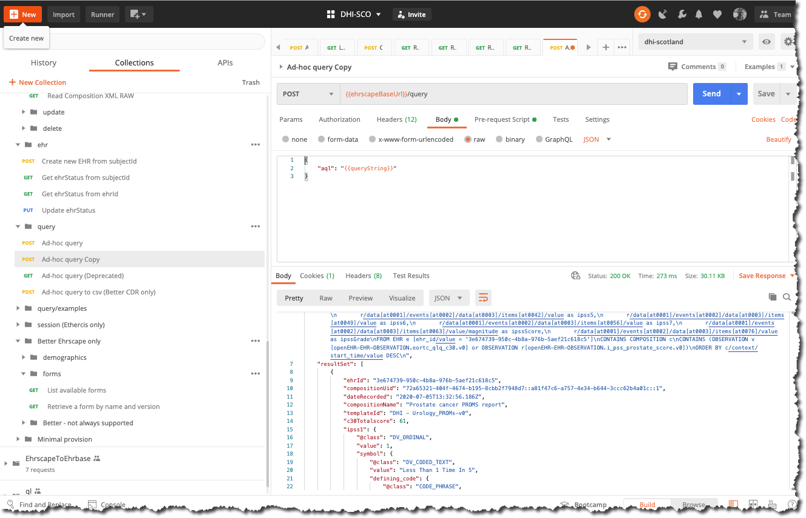

# Querying for PROMS data

This section will take you through how to query the Prostate PROMS example data, using AQL (Archetype Query Language)

The initial proposed dataset is
- the uid of the parent composition
- the ehrId of the patient
- the date of the PROMS score and author name
- Key datapoints from each of the proms recorded

!!! important "Exact query dataset to be finalised"

    The exact dataset may change pending discussion with McMillan and participant implementers


### Querying an openEHR CDR - Archetype Query language (AQL)

A CDR can be best thought of in terms of a exposing a complex object tree with the `EHR` object at the top, `Compositions` objects handling commits, but where **all** of the information in the tree can be traversed and accessed. Conceptually this is a logical query/graph language like SPARQL, the key difference being that the exact paths to the objects you might need to access are defined in the archetypes and templates you use to define and validate the data.

AQL can be written by hand but is normally done using a tool like the Better Studio 

Understanding AQL is not generally important for third-party developers. Normally the correct AQL will be supplied by the CDR owner, indeed in production it is much more likely that server-side stored queries would be used.

### DHI PROMS query

This example will retrieve the data requirement above. 

```sql
SELECT 
       e/ehr_id/value as ehrId,
       c/uid/value as compositionUid,
       c/name/value as compositionName,
       c/archetype_details/template_id/value as templateId,
       c/context/start_time/value as dateRecorded,
       v/data[at0001]/events[at0002]/data[at0003]/items[at0160]/value/magnitude as c30Totalscore,
       r/data[at0001]/events[at0002]/data[at0003]/items[at0013]/value as ipss1,
       r/data[at0001]/events[at0002]/data[at0003]/items[at0020]/value as ipss2,
       r/data[at0001]/events[at0002]/data[at0003]/items[at0028]/value as ipss3,
       r/data[at0001]/events[at0002]/data[at0003]/items[at0035]/value as ipss4,
       r/data[at0001]/events[at0002]/data[at0003]/items[at0042]/value as ipss5,
       r/data[at0001]/events[at0002]/data[at0003]/items[at0049]/value as ipss6,
       r/data[at0001]/events[at0002]/data[at0003]/items[at0056]/value as ipss7,
       r/data[at0001]/events[at0002]/data[at0003]/items[at0063]/value/magnitude as ipssScore,
       r/data[at0001]/events[at0002]/data[at0003]/items[at0076]/value as ipssGrade
    FROM EHR e [ehr_id/value = '{{ehrId}}']
        CONTAINS COMPOSITION c
        CONTAINS (OBSERVATION v[openEHR-EHR-OBSERVATION.eortc_qlq_c30.v0] or OBSERVATION r[openEHR-EHR-OBSERVATION.i_pss_prostate_score.v0])
ORDER BY c/context/start_time/value DESC
```

Don't worry about this seemingly odd format -it is essentially a mix of SQL and a path-based syntax, like SPARQL or XQuery.

Running the query is easy- just call the `POST /query` call, sending the AQL string in the body of the request but note that you should strip the string of any linefeed and carriage returns etc. The Postman 'Ad-hoc query' requesnt has a utility function under 'Pre-req' that sanitises the string and sets it into an environment variable before inserting it into the request body.


=== "Postman"
    

=== "cURL"
    ```
    curl --location --request POST '{{cdr.ehrscapeBaseUrl}}/query' \
        --header 'Content-Type: application/json' \
        --header 'Authorization: {{cdr.authToken}} \
        --data-raw '{
            "aql": "{{queryString}}"
        }'
    ```
=== "NodeJs - Axios"
    ```js
      var axios = require('axios');
        var data = JSON.stringify({"aql":"{{cdr.queryString}}"});

        var config = {
            method: 'post',
            url: '{{cdr.ehrscapeBaseUrl}}/query',
            headers: { 
                'Content-Type': 'application/json', 
                'Authorization': '{{cdr.authToken}}'
            },
            data : data
         };

        axios(config)
        .then(function (response) {
        console.log(JSON.stringify(response.data));
        })
        .catch(function (error) {
        console.log(error);
        });

    ```
=== "Python/requests"
    ```python
    import requests

    url = "https://{{cdr.ehrscapeBaseUrl}}/query"

    payload = "{\n    \"aql\": \"{{queryString}}\"\n}"
    headers = {
    'Content-Type': 'application/json',
    'Authorization': '{{cdr.authToken}}'
    }

    response = requests.request("POST", url, headers=headers, data = payload)

    print(response.text.encode('utf8'))

    ```

#### Response

```json
{
    "meta": {
        "href": "{{cdr.ehrscapeBaseUrl}}/query/"
    },
    "aql": ".... removed for brevity",
    executedAql: "...  removed for brevity"
    "resultSet": [
        {
            "ehrId": "3e674739-950c-4b8a-976b-5aef21c618c5",
            "compositionUid": "9269efd5-e37c-48af-a3f1-2a4463df0851::a81f47c6-a757-4e34-b644-3ccc62b4a01c::1",
            "dateRecorded": "2020-07-05T13:32:56.186Z",
            "compositionName": "Prostate cancer PROMS report",
            "templateId": "DHI - Urology_PROMs-v0",
            "c30Totalscore": 61,
            "ipss1": {
                "@class": "DV_ORDINAL",
                "value": 1,
                "symbol": {
                    "@class": "DV_CODED_TEXT",
                    "value": "Less Than 1 Time In 5",
                    "defining_code": {
                        "@class": "CODE_PHRASE",
                        "terminology_id": {
                            "@class": "TERMINOLOGY_ID",
                            "value": "local"
                        },
                        "code_string": "at0015"
                    }
                }
            },
            // Snipped ....
        }
    ]
}
```

