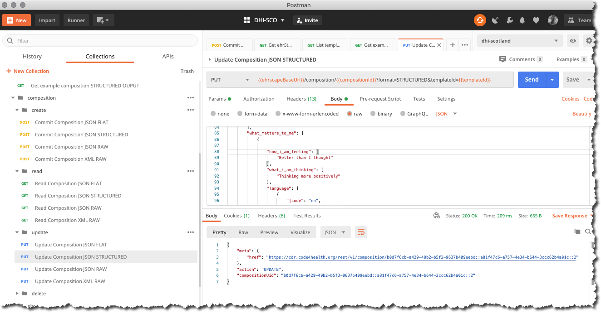

# Updating a PROMS Composition

All new data committed to an openEHR CDR is done so via a `POST /composition call` - as a JSON or XML 'blob'.

Most compositions will only need to be updated if an error or omission needs to be corrected. All openEHR data is strictly audited and version controlled, so an Update operation requires a `PUT /composition call`.

You will nearly always with to first retrieve the original version of the composition via a `GET /composition` call, update the JSON or XML object and then perform the `PUT`


#### Better Ehrscape `PUT /composition - Update composition`

##### Parameters

`compositionId`: 
This is is the `composition UID` for the **previous version** of the composition i.e the version that you are about to overwrite. Don't worry about how we find this, just use the `uid` for the composition you just committed in the last section.

`format`:
This defines the format of JSON or XML that you are requesting. Use `STRUCTURED` for this example.

`templateId`: 
This is the identifier of the openEHR template, against which you need to validate the composition, in this case, `DHI - Urology_PROMs-v0`.

##### Request

=== "Postman"
    
=== "cURL" 
    ```bash
       curl --location --request PUT '{{cdr.ehrscapeBaseUrl}}/composition/b0d7f6cb-a429-49b2-b5f3-9637b409eebd::a81f47c6-a757-4e34-b644-3ccc62b4a01c::1?format=STRUCTURED&templateId=DHI%20-%20Urology_PROMs-v0' \
    --header 'Content-Type: application/json' \
    --header 'Authorization: {{cdr.authToken}}' \
    --data-raw '{
            "prostate_cancer_proms_report": {
                "language": [
                    {
                        "|code": "en",
                        "|terminology": "ISO_639-1"
                    }
                ],
                "territory": [
                    {
                        "|code": "EN",
                        "|terminology": "ISO_3166-1"
                    }
                ],
                "context": [
                    {
                        "xds_metadata": [
                            {
                                "document_type": [
                                    "Patient recorded outcome measures"
                                ]
                            }
                        ],
                        "start_time": [
                            "2020-07-05T13:32:56.186Z"
                        ],
                        "setting": [
                            {
                                "|code": "238",
                                "|value": "other care",
                                "|terminology": "openehr"
                            }
                        ]
                    }
                ],
                "what_matters_to_me": [
                    {
                        "what_matters_to_me": [
                        "Parents",
                        "Mood",
                        "Isolation",
                        "Eating",
                        "Family",
                        "Safety"
                        ]
                    }
                    ],
                    "howru_score": [ {
                    "pain_or_discomfort": [
                        {
                            "|code": "at0041",
                            "|value": "slight",
                            "|ordinal": 1
                        }
                    ],
                    "feeling_low_or_worried": [
                        {
                            "|code": "at0042",
                            "|value": "quite a lot",
                            "|ordinal": 2
                        }
                    ],
                    "limited_in_what_i_can_do": [
                        {
                            "|code": "at0041",
                            "|value": "slight",
                            "|ordinal": 1
                        }
                    ],
                    "dependent_on_others": [
                        {
                            "|code": "at0043",
                            "|value": "extreme",
                            "|ordinal": 3
                        }
                    ],
                    "summary_score": [
                        4
                    ],
                    "time": [
                        "2020-07-21T15:41:54.175Z"
                    ],
                    "language": [
                        {
                            "|code": "en",
                            "|terminology": "ISO_639-1"
                        }
                    ],
                    "encoding": [
                        {
                            "|code": "UTF-8",
                            "|terminology": "IANA_character-sets"
                        }
                    ]
                }
            ],
                "eortc_qlq-c30": [
                
                            {
                                "trouble_doing_strenuous_activities": [
                                    {
                                        "|code": "at0007",
                                        "|value": "Quite a bit",
                                        "|ordinal": 3
                                    }
                                ],
                                "trouble_taking_a_long_walk": [
                                    {
                                        "|code": "at0040",
                                        "|value": "Quite a bit",
                                        "|ordinal": 3
                                    }
                                ],
                                "trouble_taking_a_short_walk_outside_of_the_house": [
                                    {
                                        "|code": "at0044",
                                        "|value": "Quite a bit",
                                        "|ordinal": 3
                                    }
                                ],
                                "need_to_stay_in_bed_or_a_chair_during_the_day": [
                                    {
                                        "|code": "at0049",
                                        "|value": "Very much",
                                        "|ordinal": 4
                                    }
                                ],
                                "need_help_with_eating_dressing_washing_yourself_or_using_the_toilet": [
                                    {
                                        "|code": "at0051",
                                        "|value": "A little",
                                        "|ordinal": 2
                                    }
                                ],
                                "during_the_past_week_were_limited_in_doing_either_work_or_other_daily_activities": [
                                    {
                                        "|code": "at0056",
                                        "|value": "Quite a bit",
                                        "|ordinal": 3
                                    }
                                ],
                                "during_the_past_week_were_limited_in_pursuing_hobbies_or_other_leisure_time_activities": [
                                    {
                                        "|code": "at0060",
                                        "|value": "Quite a bit",
                                        "|ordinal": 3
                                    }
                                ],
                                "during_the_past_week_had_short_of_breath": [
                                    {
                                        "|code": "at0064",
                                        "|value": "Quite a bit",
                                        "|ordinal": 3
                                    }
                                ],
                                "during_the_past_week_had_pain": [
                                    {
                                        "|code": "at0067",
                                        "|value": "A little",
                                        "|ordinal": 2
                                    }
                                ],
                                "during_the_past_week_need_to_rest": [
                                    {
                                        "|code": "at0072",
                                        "|value": "Quite a bit",
                                        "|ordinal": 3
                                    }
                                ],
                                "during_the_past_week_had_trouble_sleeping": [
                                    {
                                        "|code": "at0076",
                                        "|value": "Quite a bit",
                                        "|ordinal": 3
                                    }
                                ],
                                "during_the_past_week_felt_weak": [
                                    {
                                        "|code": "at0078",
                                        "|value": "Not at all",
                                        "|ordinal": 1
                                    }
                                ],
                                "during_the_past_week_lacked_appetite": [
                                    {
                                        "|code": "at0084",
                                        "|value": "Quite a bit",
                                        "|ordinal": 3
                                    }
                                ],
                                "during_the_past_week_felt_nauseated": [
                                    {
                                        "|code": "at0086",
                                        "|value": "Not at all",
                                        "|ordinal": 1
                                    }
                                ],
                                "during_the_past_week_had_vomited": [
                                    {
                                        "|code": "at0090",
                                        "|value": "Not at all",
                                        "|ordinal": 1
                                    }
                                ],
                                "during_the_past_week_have_been_constipated": [
                                    {
                                        "|code": "at0097",
                                        "|value": "Very much",
                                        "|ordinal": 4
                                    }
                                ],
                                "during_the_past_week_had_diarrhea": [
                                    {
                                        "|code": "at0099",
                                        "|value": "A little",
                                        "|ordinal": 2
                                    }
                                ],
                                "during_the_past_week_were_tired": [
                                    {
                                        "|code": "at0102",
                                        "|value": "Not at all",
                                        "|ordinal": 1
                                    }
                                ],
                                "during_the_past_week_pain_interfere_with_daily_activities": [
                                    {
                                        "|code": "at0109",
                                        "|value": "Very much",
                                        "|ordinal": 4
                                    }
                                ],
                                "during_the_past_week_had_difficulty_in_concentrating": [
                                    {
                                        "|code": "at0110",
                                        "|value": "Not at all",
                                        "|ordinal": 1
                                    }
                                ],
                                "during_the_past_week_felt_tense": [
                                    {
                                        "|code": "at0115",
                                        "|value": "A little",
                                        "|ordinal": 2
                                    }
                                ],
                                "during_the_past_week_were_worried": [
                                    {
                                        "|code": "at0121",
                                        "|value": "Very much",
                                        "|ordinal": 4
                                    }
                                ],
                                "during_the_past_week_felt_irritable": [
                                    {
                                        "|code": "at0123",
                                        "|value": "A little",
                                        "|ordinal": 2
                                    }
                                ],
                                "during_the_past_week_felt_depressed": [
                                    {
                                        "|code": "at0128",
                                        "|value": "Quite a bit",
                                        "|ordinal": 3
                                    }
                                ],
                                "during_the_past_week_had_difficulty_remembering_things": [
                                    {
                                        "|code": "at0133",
                                        "|value": "Very much",
                                        "|ordinal": 4
                                    }
                                ],
                                "during_the_past_week_physical_condition_or_medical_treatment_interfered_with_family_life": [
                                    {
                                        "|code": "at0135",
                                        "|value": "A little",
                                        "|ordinal": 2
                                    }
                                ],
                                "during_the_past_week_physical_condition_or_medical_treatment_interfered_with_social_activities": [
                                    {
                                        "|code": "at0138",
                                        "|value": "Not at all",
                                        "|ordinal": 1
                                    }
                                ],
                                "during_the_past_week_physical_condition_or_medical_treatment_caused_financial_difficulties": [
                                    {
                                        "|code": "at0143",
                                        "|value": "A little",
                                        "|ordinal": 2
                                    }
                                ],
                                "rate_overall_health_during_the_past_week": [
                                    {
                                        "|code": "at0147",
                                        "|value": "2",
                                        "|ordinal": 2
                                    }
                                ],
                                "rate_overall_quality_of_life_during_the_past_week": [
                                    {
                                        "|code": "at0157",
                                        "|value": "5",
                                        "|ordinal": 5
                                    }
                                ],
                                "total_score": [
                                    61
                                ],
                                "time": [
                                    "2020-07-15T16:47:06.320Z"
                                ],
                        "language": [
                            {
                                "|code": "en",
                                "|terminology": "ISO_639-1"
                            }
                        ],
                        "encoding": [
                            {
                                "|code": "UTF-8",
                                "|terminology": "IANA_character-sets"
                            }
                        ]
                    }
                ],
                "i-pss_prostate_score": [
                    {
                        "a1._incomplete_emptying": [
                            {
                                "|code": "at0015",
                                "|value": "Less Than 1 Time In 5",
                                "|ordinal": 1
                            }
                        ],
                        "a2._frequency": [
                            {
                                "|code": "at0016",
                                "|value": "Less Than Half The Time",
                                "|ordinal": 2
                            }
                        ],
                        "a3._intermittency": [
                            {
                                "|code": "at0017",
                                "|value": "About Half The Time",
                                "|ordinal": 3
                            }
                        ],
                        "a4._urgency": [
                            {
                                "|code": "at0017",
                                "|value": "About Half The Time",
                                "|ordinal": 3
                            }
                        ],
                        "a5._weak_stream": [
                            {
                                "|code": "at0016",
                                "|value": "Less Than Half The Time",
                                "|ordinal": 2
                            }
                        ],
                        "a6._straining": [
                            {
                                "|code": "at0018",
                                "|value": "More Than Half The Time",
                                "|ordinal": 4
                            }
                        ],
                        "a7._nocturia": [
                            {
                                "|code": "at0060",
                                "|value": "3 times",
                                "|ordinal": 3
                            }
                        ],
                        "total_i-pss_score": [
                            18
                        ],
                        "i-pss_score_grade": [
                            {
                                "|code": "at0087",
                                "|value": "8-19 Moderate",
                                "|terminology": "local"
                            }
                        ],
                        "time": [
                            "2020-07-05T13:32:56.186Z"
                        ],
                        "language": [
                            {
                                "|code": "en",
                                "|terminology": "ISO_639-1"
                            }
                        ],
                        "encoding": [
                            {
                                "|code": "UTF-8",
                                "|terminology": "IANA_character-sets"
                            }
                        ]
                    }
                ],
                "category": [
                    {
                        "|code": "433",
                        "|value": "event",
                        "|terminology": "openehr"
                    }
                ],
                "composer": [
                    {
                        "|name": "John Smith"
                    }
                ]
            }
        }'
    ```
=== "NodeJS/Axios"
    ```js

      var axios = require('axios');

        var config = {
        method: 'put',
        url: '{{cdr.ehrscapeBaseUrl}}/rest/v1/composition/b0d7f6cb-a429-49b2-b5f3-9637b409eebd::a81f47c6-a757-4e34-b644-3ccc62b4a01c::1?format=STRUCTURED&templateId=DHI%20-%20Urology_PROMs-v0',
        headers: { 
            'Content-Type': 'application/json', 
            'Authorization': 'Authorization: {{authToken}}', 
        }
        };

        axios(config)
        .then(function (response) {
        console.log(JSON.stringify(response.data));
        })
        .catch(function (error) {
        console.log(error);
        });

    ```
=== "Python/requests"
    ```python

     url = "{{cdr.ehrscapeBaseUrl}}/composition/b0d7f6cb-a429-49b2-b5f3-9637b409eebd::a81f47c6-a757-4e34-b644-3ccc62b4a01c::1?format=STRUCTURED&templateId=DHI%20-%20Urology_PROMs-v0"

        payload = {}
        headers = {
        'Content-Type': 'application/json',
        'Authorization: {{authToken}}',
      }

      response = requests.request("GET", url, headers=headers, data = payload)

      print(response.text.encode('utf8'))

    ```

##### Response

```json
{
    "meta": {
        "href": "{{cdr.ehrscapeBaseUrl}}/composition/b0d7f6cb-a429-49b2-b5f3-9637b409eebd::a81f47c6-a757-4e34-b644-3ccc62b4a01c::2"
    },
    "action": "UPDATE",
    "compositionUid": "b0d7f6cb-a429-49b2-b5f3-9637b409eebd::a81f47c6-a757-4e34-b644-3ccc62b4a01c::2"
}
```

If the update is successful a `200` code will be returned.


