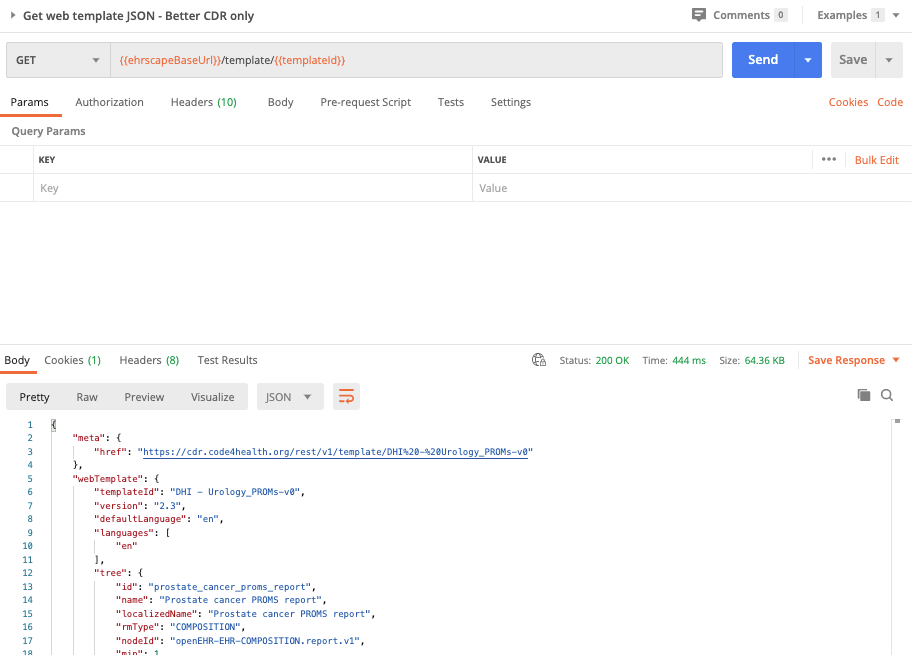

# Understanding composition Constraints and validation


As it is committed, the data will be validated against both the appropriate openEHR template and the underlying Reference Model schema.

If the data is valid, it will be stored in the CDR and is allocated a unique `compositionID`, which is returned by the POST /composition call on a successful call.

One of the key challenges in working with openEHR, is in understanding the complexities of the various datatypes and the other validation rules that apply for any particular template.

The constraint and validation rules are applied in by

1. The Reference model

2. Archetype-level constraints

3. Template-level constraints


### How to figure out which constraints apply?

As an example, I know that a particular coded entry list (perhaps drop-down) allows only a fixed selection of possible answers, which are probably coded ( a good example being a PROMS score). Where can I find how these are defined?

The ultimate source of truth is the `.opt` 'Operational template' which is uploaded to the CDR. It is essentially an aggregation of all the archetype constraints, and any local template constraints, which are than applied ot the underlying RM to give the full validation target.

The .opt is a faithful representation of the underlying in-memory objects but is a pretty difficult beast to parse and understand.

Fortunately Better provide a 'web template' utility which generates a JSON version of the validation statement but in a much more understandable format -both for human consumption and parsing. The web template facility is available both from the Ehrscape API, and as an export option from the openEHR Archetype Designer. We understand that ehrBase are developing a similar export facility and we expect this to become part of the openEHR standard in due course.

#### Better Ehrscape: `GET /template - Retrieve a web template'

##### Parameters

**`templateId`**:  
This is the identifier of the openEHR template, against which you need to validate the composition, in this case `DHI - Urology_PROMs-v0`  

**`format`**:  
This defines the format of JSON or XML that you are sending. Use `STRUCTURED` for this example.

    
##### Request

=== "Postman"
    

=== "cURL" 
    ```bash

        curl --location \
        --request GET '{{cdr.ehrscapeBaseUrl}}/template/DHI - Urology_PROMs-v0' \
        --header 'Authorization: {{cdr.authToken}}' \
    ```
=== "NodeJS/Axios"
    ```js
        var axios = require('axios');

        var config = {
         method: 'get',
         url: '{{cdr.ehrscapeBaseUrl}}/template',
        headers: { 
            'Content-Type': 'application/json', 
            'Authorization': '{{cdr.authToken}}', 
    
                };

        axios(config)
        .then(function (response) {
        console.log(JSON.stringify(response.data));
        })
        .catch(function (error) {
        console.log(error);
        });

    ```
=== "Python/requests"
        ```python
        import requests

        url = "{{cdr.ehrscapeBaseUrl}}/template"
   
        headers = {
        'Content-Type': 'application/json',
        'Authorization': '{{cdr.authToken}}',
        }

        response = requests.request("GET", url, headers=headers)

        print(response.text.encode('utf8'))
    ```

##### Response
```json
{
  {
    "meta": {
        "href": "{{cdr.ehrscapeBaseUrl}}/template/DHI%20-%20Urology_PROMs-v0"
    },
    "webTemplate": {
        "templateId": "DHI - Urology_PROMs-v0",
        "version": "2.3",
        "defaultLanguage": "en",
        "languages": [
            "en"
        ],
        "tree": {
            "id": "prostate_cancer_proms_report",
            "name": "Prostate cancer PROMS report",
            "localizedName": "Prostate cancer PROMS report",
            "rmType": "COMPOSITION",
            "nodeId": "openEHR-EHR-COMPOSITION.report.v1",
            "min": 1,
            "max": 1,
            "localizedNames": {
                "en": "Prostate cancer PROMS report"
            },
            "localizedDescriptions": {
                "en": "Document to communicate information to others, commonly in response to a request from another party."
            },
            "aqlPath": "",
            "children": [
                {
                    "id": "context",
                    "rmType": "EVENT_CONTEXT",
                    "nodeId": "",
                    "min": 1,
                    "max": 1,
                    "aqlPath": "/context",
                    "children": [
                        {
                            "id": "xds_metadata",
                            "name": "XDS Metadata",
                            "localizedName": "XDS Metadata",
                            "rmType": "CLUSTER",
                            "nodeId": "openEHR-EHR-CLUSTER.xds_metadata.v0",
                            "min": 0,
                            "max": 1,
                            "localizedNames": {
                                "en": "XDS Metadata"
                            },
                            "localizedDescriptions": {
                                "en": "Additional composition metadata aligned with IHE-XDS which is not already available from the Reference Model COMPOSITION class."
                            },
                            "aqlPath": "/context/other_context[at0001]/items[openEHR-EHR-CLUSTER.xds_metadata.v0]",
                            "children": [
                                {
                                    "id": "document_type",
                                    "name": "Document type",
                                    "localizedName": "Document type",
                                    "rmType": "DV_TEXT",
                                    "nodeId": "at0003",
                                    "min": 0,
                                    "max": 1,
                                    "localizedNames": {
                                        "en": "Document type"
                                    },
                                    "localizedDescriptions": {
                                        "en": "The code specifying the precise type of document from the user perspective. Normally selected from a valueset provided by the local IHE-XDS Affinity Domain or national standard."
                                    },
                                    "annotations": {
                                        "comment": "for example:  Pulmonary History and Physical, Discharge Summary, Ultrasound Report.\r\nThese codes are specific to an XDS Affinity Domain."
                                    },
                                    "aqlPath": "/context/other_context[at0001]/items[openEHR-EHR-CLUSTER.xds_metadata.v0]/items[at0003]/value",
                                    "inputs": [
                                        {
                                            "type": "TEXT",
                                            "defaultValue": "Patient recorded outcome measures"
                                        }
                                    ]
                                }
                            ]
                        },
                        {
                            "id": "start_time",
                            "name": "Start_time",
                            "rmType": "DV_DATE_TIME",
                            "min": 0,
                            "max": 1,
                            "aqlPath": "/context/start_time",
                            "inputs": [
                                {
                                    "type": "DATETIME"
                                }
                            ],
                            "inContext": true
                        },
                        {
                            "id": "setting",
                            "name": "Setting",
                            "rmType": "DV_CODED_TEXT",
                            "min": 0,
                            "max": 1,
                            "aqlPath": "/context/setting",
                            "inputs": [
                                {
                                    "suffix": "code",
                                    "type": "TEXT"
                                },
                                {
                                    "suffix": "value",
                                    "type": "TEXT"
                                }
                            ],
                            "inContext": true
                        }
                    ]
                },
                {
                    "id": "what_matters_to_me",
                    "name": "What matters to me",
                    "localizedName": "What matters to me",
                    "rmType": "OBSERVATION",
                    "nodeId": "openEHR-EHR-OBSERVATION.story.v1",
                    "min": 0,
                    "max": 1,
                    "localizedNames": {
                        "en": "What matters to me"
                    },
                    "localizedDescriptions": {
                        "en": "The subjective clinical history of the subject of care as recorded directly by the subject, or reported to a clinician by the subject or a carer."
                    },
                    "aqlPath": "/content[openEHR-EHR-OBSERVATION.story.v1,'What matters to me']",
                    "children": [
                        {
                            "id": "what_matters_to_me",
                            "name": "What matters to me",
                            "localizedName": "What matters to me",
                            "rmType": "DV_TEXT",
                            "nodeId": "at0004",
                            "min": 0,
                            "max": -1,
                            "localizedNames": {
                                "en": "What matters to me"
                            },
                            "localizedDescriptions": {
                                "en": "Narrative description of the story or clinical history for the subject of care."
                            },
                            "aqlPath": "/content[openEHR-EHR-OBSERVATION.story.v1,'What matters to me']/data[at0001]/events[at0002]/data[at0003]/items[at0004,'What matters to me']/value",
                            "inputs": [
                                {
                                    "type": "TEXT",
                                    "list": [
                                        {
                                            "value": "Sleep",
                                            "label": "Sleep"
                                        },
                                        {
                                            "value": "Work",
                                            "label": "Work"
                                        },
                                        {
                                            "value": "Money",
                                            "label": "Money"
                                        },
                                        {
                                            "value": "Safety",
                                            "label": "Safety"
                                        },
                                        {
                                            "value": "Relationships",
                                            "label": "Relationships"
                                        },
                                        {
                                            "value": "Parents",
                                            "label": "Parents"
                                        },
                                        {
                                            "value": "Family",
                                            "label": "Family"
                                        },
                                        {
                                            "value": "Children",
                                            "label": "Children"
                                        },
                                        {
                                            "value": "Sex",
                                            "label": "Sex"
                                        },
                                        {
                                            "value": "Weight",
                                            "label": "Weight"
                                        },
                                        {
                                            "value": "Eating",
                                            "label": "Eating"
                                        },
                                        {
                                            "value": "Wellness",
                                            "label": "Wellness"
                                        },
                                        {
                                            "value": "Depression",
                                            "label": "Depression"
                                        },
                                        {
                                            "value": "Mood",
                                            "label": "Mood"
                                        },
                                        {
                                            "value": "Anxiety",
                                            "label": "Anxiety"
                                        },
                                        {
                                            "value": "Stress",
                                            "label": "Stress"
                                        },
                                        {
                                            "value": "Exercise",
                                            "label": "Exercise"
                                        },
                                        {
                                            "value": "Mobility",
                                            "label": "Mobility"
                                        },
                                        {
                                            "value": "Toileting",
                                            "label": "Toileting"
                                        },
                                        {
                                            "value": "Pain",
                                            "label": "Pain"
                                        },
                                        {
                                            "value": "Independence",
                                            "label": "Independence"
                                        },
                                        {
                                            "value": "Isolation",
                                            "label": "Isolation"
                                        },
                                        {
                                            "value": "Information",
                                            "label": "Information"
                                        },
                                        {
                                            "value": "Support",
                                            "label": "Support"
                                        }
                                    ],
                                    "listOpen": false
                                }
                            ]
                        },
                        {
                            "id": "time",
                            "name": "Time",
                            "rmType": "DV_DATE_TIME",
                            "min": 0,
                            "max": 1,
                            "aqlPath": "/content[openEHR-EHR-OBSERVATION.story.v1,'What matters to me']/data[at0001]/events[at0002]/time",
                            "inputs": [
                                {
                                    "type": "DATETIME"
                                }
                            ],
                            "inContext": true
                        },
                        {
                            "id": "language",
                            "name": "Language",
                            "rmType": "CODE_PHRASE",
                            "min": 0,
                            "max": 1,
                            "aqlPath": "/content[openEHR-EHR-OBSERVATION.story.v1,'What matters to me']/language",
                            "inContext": true
                        },
                        {
                            "id": "encoding",
                            "name": "Encoding",
                            "rmType": "CODE_PHRASE",
                            "min": 0,
                            "max": 1,
                            "aqlPath": "/content[openEHR-EHR-OBSERVATION.story.v1,'What matters to me']/encoding",
                            "inContext": true
                        },
                        {
                            "id": "subject",
                            "name": "Subject",
                            "rmType": "PARTY_PROXY",
                            "min": 0,
                            "max": 1,
                            "aqlPath": "/content[openEHR-EHR-OBSERVATION.story.v1,'What matters to me']/subject",
                            "inputs": [
                                {
                                    "suffix": "id",
                                    "type": "TEXT"
                                },
                                {
                                    "suffix": "id_scheme",
                                    "type": "TEXT"
                                },
                                {
                                    "suffix": "id_namespace",
                                    "type": "TEXT"
                                },
                                {
                                    "suffix": "name",
                                    "type": "TEXT"
                                }
                            ],
                            "inContext": true
                        }
                    ]
                },
                {
                    "id": "howru_score",
                    "name": "howRU score",
                    "localizedName": "howRU score",
                    "rmType": "OBSERVATION",
                    "nodeId": "openEHR-EHR-OBSERVATION.howru.v1",
                    "min": 0,
                    "max": 1,
                    "localizedNames": {
                        "en": "howRU score"
                    },
                    "localizedDescriptions": {
                        "en": "Information captured by the howRU™ patient-reported outcomes instrument."
                    },
                    "aqlPath": "/content[openEHR-EHR-OBSERVATION.howru.v1]",
                    "children": [
                        {
                            "id": "pain_or_discomfort",
                            "name": "Pain or discomfort",
                            "localizedName": "Pain or discomfort",
                            "rmType": "DV_ORDINAL",
                            "nodeId": "at0044",
                            "min": 1,
                            "max": 1,
                            "localizedNames": {
                                "en": "Pain or discomfort"
                            },
                            "localizedDescriptions": {
                                "en": "Symptoms such as pain – includes all physical forms of discomfort such as breathlessness, itching, dizziness or nausea."
                            },
                            "aqlPath": "/content[openEHR-EHR-OBSERVATION.howru.v1]/data[at0001]/events[at0002]/data[at0003]/items[at0044]/value",
                            "inputs": [
                                {
                                    "type": "CODED_TEXT",
                                    "list": [
                                        {
                                            "value": "at0040",
                                            "label": "none",
                                            "localizedLabels": {
                                                "en": "none"
                                            },
                                            "localizedDescriptions": {
                                                "en": "The subject is not affected at all."
                                            },
                                            "ordinal": 0
                                        },
                                        {
                                            "value": "at0041",
                                            "label": "slight",
                                            "localizedLabels": {
                                                "en": "slight"
                                            },
                                            "localizedDescriptions": {
                                                "en": "The subject is only slighly affected."
                                            },
                                            "ordinal": 1
                                        },
                                        {
                                            "value": "at0042",
                                            "label": "quite a lot",
                                            "localizedLabels": {
                                                "en": "quite a lot"
                                            },
                                            "localizedDescriptions": {
                                                "en": "The subject is considerably affected."
                                            },
                                            "ordinal": 2
                                        },
                                        {
                                            "value": "at0043",
                                            "label": "extreme",
                                            "localizedLabels": {
                                                "en": "extreme"
                                            },
                                            "localizedDescriptions": {
                                                "en": "The subject is extremely affected."
                                            },
                                            "ordinal": 3
                                        }
                                    ]
                                }
                            ],
                            "termBindings": {
                                "LOINC": {
                                    "value": "[LOINC(2_30)::55745-4]",
                                    "terminologyId": "LOINC"
                                }
                            }
                        },
                        {
                            "id": "feeling_low_or_worried",
                            "name": "Feeling low or worried",
                            "localizedName": "Feeling low or worried",
                            "rmType": "DV_ORDINAL",
                            "nodeId": "at0008",
                            "min": 1,
                            "max": 1,
                            "localizedNames": {
                                "en": "Feeling low or worried"
                            },
                            "localizedDescriptions": {
                                "en": "Feeling low or worried – includes all psychological states, including anxiety, feeling low and depression."
                            },
                            "aqlPath": "/content[openEHR-EHR-OBSERVATION.howru.v1]/data[at0001]/events[at0002]/data[at0003]/items[at0008]/value",
                            "inputs": [
                                {
                                    "type": "CODED_TEXT",
                                    "list": [
                                        {
                                            "value": "at0040",
                                            "label": "none",
                                            "localizedLabels": {
                                                "en": "none"
                                            },
                                            "localizedDescriptions": {
                                                "en": "The subject is not affected at all."
                                            },
                                            "ordinal": 0
                                        },
                                        {
                                            "value": "at0041",
                                            "label": "slight",
                                            "localizedLabels": {
                                                "en": "slight"
                                            },
                                            "localizedDescriptions": {
                                                "en": "The subject is only slighly affected."
                                            },
                                            "ordinal": 1
                                        },
                                        {
                                            "value": "at0042",
                                            "label": "quite a lot",
                                            "localizedLabels": {
                                                "en": "quite a lot"
                                            },
                                            "localizedDescriptions": {
                                                "en": "The subject is considerably affected."
                                            },
                                            "ordinal": 2
                                        },
                                        {
                                            "value": "at0043",
                                            "label": "extreme",
                                            "localizedLabels": {
                                                "en": "extreme"
                                            },
                                            "localizedDescriptions": {
                                                "en": "The subject is extremely affected."
                                            },
                                            "ordinal": 3
                                        }
                                    ]
                                }
                            ],
                            "termBindings": {
                                "LOINC": {
                                    "value": "[LOINC::55746-2]",
                                    "terminologyId": "LOINC"
                                }
                            }
                        },
                        {
                            "id": "limited_in_what_i_can_do",
                            "name": "Limited in what I can do",
                            "localizedName": "Limited in what I can do",
                            "rmType": "DV_ORDINAL",
                            "nodeId": "at0039",
                            "min": 1,
                            "max": 1,
                            "localizedNames": {
                                "en": "Limited in what I can do"
                            },
                            "localizedDescriptions": {
                                "en": "Limited in what I can do – includes incapacity due to physical or psychological reasons, such as not being able to perform activities of daily living, or not being able to carry out leisure activities."
                            },
                            "aqlPath": "/content[openEHR-EHR-OBSERVATION.howru.v1]/data[at0001]/events[at0002]/data[at0003]/items[at0039]/value",
                            "inputs": [
                                {
                                    "type": "CODED_TEXT",
                                    "list": [
                                        {
                                            "value": "at0040",
                                            "label": "none",
                                            "localizedLabels": {
                                                "en": "none"
                                            },
                                            "localizedDescriptions": {
                                                "en": "The subject is not affected at all."
                                            },
                                            "ordinal": 0
                                        },
                                        {
                                            "value": "at0041",
                                            "label": "slight",
                                            "localizedLabels": {
                                                "en": "slight"
                                            },
                                            "localizedDescriptions": {
                                                "en": "The subject is only slighly affected."
                                            },
                                            "ordinal": 1
                                        },
                                        {
                                            "value": "at0042",
                                            "label": "quite a lot",
                                            "localizedLabels": {
                                                "en": "quite a lot"
                                            },
                                            "localizedDescriptions": {
                                                "en": "The subject is considerably affected."
                                            },
                                            "ordinal": 2
                                        },
                                        {
                                            "value": "at0043",
                                            "label": "extreme",
                                            "localizedLabels": {
                                                "en": "extreme"
                                            },
                                            "localizedDescriptions": {
                                                "en": "The subject is extremely affected."
                                            },
                                            "ordinal": 3
                                        }
                                    ]
                                }
                            ],
                            "termBindings": {
                                "LOINC": {
                                    "value": "[LOINC::55747-0]",
                                    "terminologyId": "LOINC"
                                }
                            }
                        },
                        {
                            "id": "dependent_on_others",
                            "name": "Dependent on others",
                            "localizedName": "Dependent on others",
                            "rmType": "DV_ORDINAL",
                            "nodeId": "at0006",
                            "min": 1,
                            "max": 1,
                            "localizedNames": {
                                "en": "Dependent on others"
                            },
                            "localizedDescriptions": {
                                "en": "Dependent on others – the need to rely on other people or equipment."
                            },
                            "aqlPath": "/content[openEHR-EHR-OBSERVATION.howru.v1]/data[at0001]/events[at0002]/data[at0003]/items[at0006]/value",
                            "inputs": [
                                {
                                    "type": "CODED_TEXT",
                                    "list": [
                                        {
                                            "value": "at0040",
                                            "label": "none",
                                            "localizedLabels": {
                                                "en": "none"
                                            },
                                            "localizedDescriptions": {
                                                "en": "The subject is not affected at all."
                                            },
                                            "ordinal": 0
                                        },
                                        {
                                            "value": "at0041",
                                            "label": "slight",
                                            "localizedLabels": {
                                                "en": "slight"
                                            },
                                            "localizedDescriptions": {
                                                "en": "The subject is only slighly affected."
                                            },
                                            "ordinal": 1
                                        },
                                        {
                                            "value": "at0042",
                                            "label": "quite a lot",
                                            "localizedLabels": {
                                                "en": "quite a lot"
                                            },
                                            "localizedDescriptions": {
                                                "en": "The subject is considerably affected."
                                            },
                                            "ordinal": 2
                                        },
                                        {
                                            "value": "at0043",
                                            "label": "extreme",
                                            "localizedLabels": {
                                                "en": "extreme"
                                            },
                                            "localizedDescriptions": {
                                                "en": "The subject is extremely affected."
                                            },
                                            "ordinal": 3
                                        }
                                    ]
                                }
                            ],
                            "termBindings": {
                                "LOINC": {
                                    "value": "[LOINC::55745-8]",
                                    "terminologyId": "LOINC"
                                }
                            }
                        },
                        {
                            "id": "summary_score",
                            "name": "Summary score",
                            "localizedName": "Summary score",
                            "rmType": "DV_COUNT",
                            "nodeId": "at0004",
                            "min": 1,
                            "max": 1,
                            "localizedNames": {
                                "en": "Summary score"
                            },
                            "localizedDescriptions": {
                                "en": "An overall score combining the 4 individual ratings. "
                            },
                            "aqlPath": "/content[openEHR-EHR-OBSERVATION.howru.v1]/data[at0001]/events[at0002]/data[at0003]/items[at0004]/value",
                            "inputs": [
                                {
                                    "type": "INTEGER",
                                    "validation": {
                                        "range": {
                                            "minOp": ">=",
                                            "min": 0,
                                            "maxOp": "<=",
                                            "max": 12
                                        }
                                    }
                                }
                            ],
                            "termBindings": {
                                "LOINC": {
                                    "value": "[LOINC::55749-6]",
                                    "terminologyId": "LOINC"
                                }
                            }
                        },
                        {
                            "id": "time",
                            "name": "Time",
                            "rmType": "DV_DATE_TIME",
                            "min": 0,
                            "max": 1,
                            "aqlPath": "/content[openEHR-EHR-OBSERVATION.howru.v1]/data[at0001]/events[at0002]/time",
                            "inputs": [
                                {
                                    "type": "DATETIME"
                                }
                            ],
                            "inContext": true
                        },
                        {
                            "id": "language",
                            "name": "Language",
                            "rmType": "CODE_PHRASE",
                            "min": 0,
                            "max": 1,
                            "aqlPath": "/content[openEHR-EHR-OBSERVATION.howru.v1]/language",
                            "inContext": true
                        },
                        {
                            "id": "encoding",
                            "name": "Encoding",
                            "rmType": "CODE_PHRASE",
                            "min": 0,
                            "max": 1,
                            "aqlPath": "/content[openEHR-EHR-OBSERVATION.howru.v1]/encoding",
                            "inContext": true
                        },
                        {
                            "id": "subject",
                            "name": "Subject",
                            "rmType": "PARTY_PROXY",
                            "min": 0,
                            "max": 1,
                            "aqlPath": "/content[openEHR-EHR-OBSERVATION.howru.v1]/subject",
                            "inputs": [
                                {
                                    "suffix": "id",
                                    "type": "TEXT"
                                },
                                {
                                    "suffix": "id_scheme",
                                    "type": "TEXT"
                                },
                                {
                                    "suffix": "id_namespace",
                                    "type": "TEXT"
                                },
                                {
                                    "suffix": "name",
                                    "type": "TEXT"
                                }
                            ],
                            "inContext": true
                        }
                    ],
                    "termBindings": {
                        "LOINC": {
                            "value": "[LOINC::55744-7]",
                            "terminologyId": "LOINC"
                        }
                    }
                },
                {
                    "id": "eortc_qlq-c30",
                    "name": "EORTC QLQ-C30",
                    "localizedName": "EORTC QLQ-C30",
                    "rmType": "OBSERVATION",
                    "nodeId": "openEHR-EHR-OBSERVATION.eortc_qlq_c30.v0",
                    "min": 0,
                    "max": 1,
                    "localizedNames": {
                        "en": "EORTC QLQ-C30"
                    },
                    "localizedDescriptions": {
                        "en": "A 30-item measure of physical, role, emotional, and social functioning, as well as cognition, symptoms (for example fatigue, pain, and dyspnea), and global quality of life in patients with cancer. A core part of the EORTC  quality  of  life  questionnaire  (QLQ), an integrated  system  for  assessing  the  health-related quality of life (QoL) of cancer patients participating in international clinical trials."
                    },
                    "aqlPath": "/content[openEHR-EHR-OBSERVATION.eortc_qlq_c30.v0]",
                    "children": [
                        {
                            "id": "any_event",
                            "name": "Any event",
                            "localizedName": "Any event",
                            "rmType": "POINT_EVENT",
                            "nodeId": "at0002",
                            "min": 0,
                            "max": -1,
                            "localizedNames": {
                                "en": "Any event"
                            },
                            "localizedDescriptions": {
                                "en": "Default, unspecified point in time or interval event which may be explicitly defined in a template or at run-time."
                            },
                            "aqlPath": "/content[openEHR-EHR-OBSERVATION.eortc_qlq_c30.v0]/data[at0001]/events[at0002]",
                            "children": [
                                {
                                    "id": "trouble_doing_strenuous_activities",
                                    "name": "Trouble doing strenuous activities",
                                    "localizedName": "Trouble doing strenuous activities",
                                    "rmType": "DV_ORDINAL",
                                    "nodeId": "at0004",
                                    "min": 0,
                                    "max": 1,
                                    "localizedNames": {
                                        "en": "Trouble doing strenuous activities"
                                    },
                                    "localizedDescriptions": {
                                        "en": "Original question:\r\nDo you have any trouble doing strenuous activities, like carrying a heavy shopping bag or a suitcase?"
                                    },
                                    "annotations": {
                                        "Question_number": "1",
                                        "Scale": "PF2"
                                    },
                                    "aqlPath": "/content[openEHR-EHR-OBSERVATION.eortc_qlq_c30.v0]/data[at0001]/events[at0002]/data[at0003]/items[at0004]/value",
                                    "inputs": [
                                        {
                                            "type": "CODED_TEXT",
                                            "list": [
                                                {
                                                    "value": "at0005",
                                                    "label": "Not at all",
                                                    "localizedLabels": {
                                                        "en": "Not at all"
                                                    },
                                                    "localizedDescriptions": {
                                                        "en": ""
                                                    },
                                                    "ordinal": 1
                                                },
                                                {
                                                    "value": "at0006",
                                                    "label": "A little",
                                                    "localizedLabels": {
                                                        "en": "A little"
                                                    },
                                                    "localizedDescriptions": {
                                                        "en": ""
                                                    },
                                                    "ordinal": 2
                                                },
                                                {
                                                    "value": "at0007",
                                                    "label": "Quite a bit",
                                                    "localizedLabels": {
                                                        "en": "Quite a bit"
                                                    },
                                                    "localizedDescriptions": {
                                                        "en": ""
                                                    },
                                                    "ordinal": 3
                                                },
                                                {
                                                    "value": "at0008",
                                                    "label": "Very much",
                                                    "localizedLabels": {
                                                        "en": "Very much"
                                                    },
                                                    "localizedDescriptions": {
                                                        "en": ""
                                                    },
                                                    "ordinal": 4
                                                }
                                            ]
                                        }
                                    ]
                                },
                                {
                                    "id": "trouble_taking_a_long_walk",
                                    "name": "Trouble taking a long walk",
                                    "localizedName": "Trouble taking a long walk",
                                    "rmType": "DV_ORDINAL",
                                    "nodeId": "at0009",
                                    "min": 0,
                                    "max": 1,
                                    "localizedNames": {
                                        "en": "Trouble taking a long walk"
                                    },
                                    "localizedDescriptions": {
                                        "en": "Original question:\r\nDo you have any trouble taking a long walk?"
                                    },
                                    "annotations": {
                                        "Question_number": "2",
                                        "Scale": "PF2"
                                    },
                                    "aqlPath": "/content[openEHR-EHR-OBSERVATION.eortc_qlq_c30.v0]/data[at0001]/events[at0002]/data[at0003]/items[at0009]/value",
                                    "inputs": [
                                        {
                                            "type": "CODED_TEXT",
                                            "list": [
                                                {
                                                    "value": "at0038",
                                                    "label": "Not at all",
                                                    "localizedLabels": {
                                                        "en": "Not at all"
                                                    },
                                                    "localizedDescriptions": {
                                                        "en": ""
                                                    },
                                                    "ordinal": 1
                                                },
                                                {
                                                    "value": "at0039",
                                                    "label": "A little",
                                                    "localizedLabels": {
                                                        "en": "A little"
                                                    },
                                                    "localizedDescriptions": {
                                                        "en": ""
                                                    },
                                                    "ordinal": 2
                                                },
                                                {
                                                    "value": "at0040",
                                                    "label": "Quite a bit",
                                                    "localizedLabels": {
                                                        "en": "Quite a bit"
                                                    },
                                                    "localizedDescriptions": {
                                                        "en": ""
                                                    },
                                                    "ordinal": 3
                                                },
                                                {
                                                    "value": "at0041",
                                                    "label": "Very much",
                                                    "localizedLabels": {
                                                        "en": "Very much"
                                                    },
                                                    "localizedDescriptions": {
                                                        "en": ""
                                                    },
                                                    "ordinal": 4
                                                }
                                            ]
                                        }
                                    ]
                                },
                                {
                                    "id": "trouble_taking_a_short_walk_outside_of_the_house",
                                    "name": "Trouble taking a short walk outside of the house",
                                    "localizedName": "Trouble taking a short walk outside of the house",
                                    "rmType": "DV_ORDINAL",
                                    "nodeId": "at0010",
                                    "min": 0,
                                    "max": 1,
                                    "localizedNames": {
                                        "en": "Trouble taking a short walk outside of the house"
                                    },
                                    "localizedDescriptions": {
                                        "en": "Original question:\r\nDo you have any trouble taking a short walk outside of the house?"
                                    },
                                    "annotations": {
                                        "Question_number": "3",
                                        "Scale": "PF2"
                                    },
                                    "aqlPath": "/content[openEHR-EHR-OBSERVATION.eortc_qlq_c30.v0]/data[at0001]/events[at0002]/data[at0003]/items[at0010]/value",
                                    "inputs": [
                                        {
                                            "type": "CODED_TEXT",
                                            "list": [
                                                {
                                                    "value": "at0042",
                                                    "label": "Not at all",
                                                    "localizedLabels": {
                                                        "en": "Not at all"
                                                    },
                                                    "localizedDescriptions": {
                                                        "en": ""
                                                    },
                                                    "ordinal": 1
                                                },
                                                {
                                                    "value": "at0043",
                                                    "label": "A little",
                                                    "localizedLabels": {
                                                        "en": "A little"
                                                    },
                                                    "localizedDescriptions": {
                                                        "en": ""
                                                    },
                                                    "ordinal": 2
                                                },
                                                {
                                                    "value": "at0044",
                                                    "label": "Quite a bit",
                                                    "localizedLabels": {
                                                        "en": "Quite a bit"
                                                    },
                                                    "localizedDescriptions": {
                                                        "en": ""
                                                    },
                                                    "ordinal": 3
                                                },
                                                {
                                                    "value": "at0045",
                                                    "label": "Very much",
                                                    "localizedLabels": {
                                                        "en": "Very much"
                                                    },
                                                    "localizedDescriptions": {
                                                        "en": ""
                                                    },
                                                    "ordinal": 4
                                                }
                                            ]
                                        }
                                    ]
                                },
                                {
                                    "id": "need_to_stay_in_bed_or_a_chair_during_the_day",
                                    "name": "Need to stay in bed or a chair during the day",
                                    "localizedName": "Need to stay in bed or a chair during the day",
                                    "rmType": "DV_ORDINAL",
                                    "nodeId": "at0011",
                                    "min": 0,
                                    "max": 1,
                                    "localizedNames": {
                                        "en": "Need to stay in bed or a chair during the day"
                                    },
                                    "localizedDescriptions": {
                                        "en": "Original question:\r\nDo you need to stay in bed or a chair during the day?"
                                    },
                                    "annotations": {
                                        "Question_number": "4",
                                        "Scale": "PF2"
                                    },
                                    "aqlPath": "/content[openEHR-EHR-OBSERVATION.eortc_qlq_c30.v0]/data[at0001]/events[at0002]/data[at0003]/items[at0011]/value",
                                    "inputs": [
                                        {
                                            "type": "CODED_TEXT",
                                            "list": [
                                                {
                                                    "value": "at0046",
                                                    "label": "Not at all",
                                                    "localizedLabels": {
                                                        "en": "Not at all"
                                                    },
                                                    "localizedDescriptions": {
                                                        "en": ""
                                                    },
                                                    "ordinal": 1
                                                },
                                                {
                                                    "value": "at0047",
                                                    "label": "A little",
                                                    "localizedLabels": {
                                                        "en": "A little"
                                                    },
                                                    "localizedDescriptions": {
                                                        "en": ""
                                                    },
                                                    "ordinal": 2
                                                },
                                                {
                                                    "value": "at0048",
                                                    "label": "Quite a bit",
                                                    "localizedLabels": {
                                                        "en": "Quite a bit"
                                                    },
                                                    "localizedDescriptions": {
                                                        "en": ""
                                                    },
                                                    "ordinal": 3
                                                },
                                                {
                                                    "value": "at0049",
                                                    "label": "Very much",
                                                    "localizedLabels": {
                                                        "en": "Very much"
                                                    },
                                                    "localizedDescriptions": {
                                                        "en": ""
                                                    },
                                                    "ordinal": 4
                                                }
                                            ]
                                        }
                                    ]
                                },
                                {
                                    "id": "need_help_with_eating_dressing_washing_yourself_or_using_the_toilet",
                                    "name": "Need help with eating, dressing, washing yourself or using the toilet",
                                    "localizedName": "Need help with eating, dressing, washing yourself or using the toilet",
                                    "rmType": "DV_ORDINAL",
                                    "nodeId": "at0012",
                                    "min": 0,
                                    "max": 1,
                                    "localizedNames": {
                                        "en": "Need help with eating, dressing, washing yourself or using the toilet"
                                    },
                                    "localizedDescriptions": {
                                        "en": "Original question:\r\nDo you need help with eating, dressing, washing yourself or using the toilet?"
                                    },
                                    "annotations": {
                                        "Question_number": "5",
                                        "Scale": "PF2"
                                    },
                                    "aqlPath": "/content[openEHR-EHR-OBSERVATION.eortc_qlq_c30.v0]/data[at0001]/events[at0002]/data[at0003]/items[at0012]/value",
                                    "inputs": [
                                        {
                                            "type": "CODED_TEXT",
                                            "list": [
                                                {
                                                    "value": "at0050",
                                                    "label": "Not at all",
                                                    "localizedLabels": {
                                                        "en": "Not at all"
                                                    },
                                                    "localizedDescriptions": {
                                                        "en": ""
                                                    },
                                                    "ordinal": 1
                                                },
                                                {
                                                    "value": "at0051",
                                                    "label": "A little",
                                                    "localizedLabels": {
                                                        "en": "A little"
                                                    },
                                                    "localizedDescriptions": {
                                                        "en": ""
                                                    },
                                                    "ordinal": 2
                                                },
                                                {
                                                    "value": "at0052",
                                                    "label": "Quite a bit",
                                                    "localizedLabels": {
                                                        "en": "Quite a bit"
                                                    },
                                                    "localizedDescriptions": {
                                                        "en": ""
                                                    },
                                                    "ordinal": 3
                                                },
                                                {
                                                    "value": "at0053",
                                                    "label": "Very much",
                                                    "localizedLabels": {
                                                        "en": "Very much"
                                                    },
                                                    "localizedDescriptions": {
                                                        "en": ""
                                                    },
                                                    "ordinal": 4
                                                }
                                            ]
                                        }
                                    ]
                                },
                                {
                                    "id": "during_the_past_week_were_limited_in_doing_either_work_or_other_daily_activities",
                                    "name": "During the past week were limited in doing either work or other daily activities",
                                    "localizedName": "During the past week were limited in doing either work or other daily activities",
                                    "rmType": "DV_ORDINAL",
                                    "nodeId": "at0013",
                                    "min": 0,
                                    "max": 1,
                                    "localizedNames": {
                                        "en": "During the past week were limited in doing either work or other daily activities"
                                    },
                                    "localizedDescriptions": {
                                        "en": "Original question:\r\nDuring the past week: Were you limited in doing either your work or other daily activities?"
                                    },
                                    "annotations": {
                                        "Question_number": "6",
                                        "Scale": "RF2"
                                    },
                                    "aqlPath": "/content[openEHR-EHR-OBSERVATION.eortc_qlq_c30.v0]/data[at0001]/events[at0002]/data[at0003]/items[at0013]/value",
                                    "inputs": [
                                        {
                                            "type": "CODED_TEXT",
                                            "list": [
                                                {
                                                    "value": "at0054",
                                                    "label": "Not at all",
                                                    "localizedLabels": {
                                                        "en": "Not at all"
                                                    },
                                                    "localizedDescriptions": {
                                                        "en": ""
                                                    },
                                                    "ordinal": 1
                                                },
                                                {
                                                    "value": "at0055",
                                                    "label": "A little",
                                                    "localizedLabels": {
                                                        "en": "A little"
                                                    },
                                                    "localizedDescriptions": {
                                                        "en": ""
                                                    },
                                                    "ordinal": 2
                                                },
                                                {
                                                    "value": "at0056",
                                                    "label": "Quite a bit",
                                                    "localizedLabels": {
                                                        "en": "Quite a bit"
                                                    },
                                                    "localizedDescriptions": {
                                                        "en": ""
                                                    },
                                                    "ordinal": 3
                                                },
                                                {
                                                    "value": "at0057",
                                                    "label": "Very much",
                                                    "localizedLabels": {
                                                        "en": "Very much"
                                                    },
                                                    "localizedDescriptions": {
                                                        "en": ""
                                                    },
                                                    "ordinal": 4
                                                }
                                            ]
                                        }
                                    ]
                                },
                                {
                                    "id": "during_the_past_week_were_limited_in_pursuing_hobbies_or_other_leisure_time_activities",
                                    "name": "During the past week were limited in pursuing hobbies or other leisure time activities",
                                    "localizedName": "During the past week were limited in pursuing hobbies or other leisure time activities",
                                    "rmType": "DV_ORDINAL",
                                    "nodeId": "at0014",
                                    "min": 0,
                                    "max": 1,
                                    "localizedNames": {
                                        "en": "During the past week were limited in pursuing hobbies or other leisure time activities"
                                    },
                                    "localizedDescriptions": {
                                        "en": "Original question:\r\nDuring the past week: Were you limited in pursuing your hobbies or other leisure time activities?"
                                    },
                                    "annotations": {
                                        "Question_number": "7",
                                        "Scale": "RF2"
                                    },
                                    "aqlPath": "/content[openEHR-EHR-OBSERVATION.eortc_qlq_c30.v0]/data[at0001]/events[at0002]/data[at0003]/items[at0014]/value",
                                    "inputs": [
                                        {
                                            "type": "CODED_TEXT",
                                            "list": [
                                                {
                                                    "value": "at0058",
                                                    "label": "Not at all",
                                                    "localizedLabels": {
                                                        "en": "Not at all"
                                                    },
                                                    "localizedDescriptions": {
                                                        "en": ""
                                                    },
                                                    "ordinal": 1
                                                },
                                                {
                                                    "value": "at0059",
                                                    "label": "A little",
                                                    "localizedLabels": {
                                                        "en": "A little"
                                                    },
                                                    "localizedDescriptions": {
                                                        "en": ""
                                                    },
                                                    "ordinal": 2
                                                },
                                                {
                                                    "value": "at0060",
                                                    "label": "Quite a bit",
                                                    "localizedLabels": {
                                                        "en": "Quite a bit"
                                                    },
                                                    "localizedDescriptions": {
                                                        "en": ""
                                                    },
                                                    "ordinal": 3
                                                },
                                                {
                                                    "value": "at0061",
                                                    "label": "Very much",
                                                    "localizedLabels": {
                                                        "en": "Very much"
                                                    },
                                                    "localizedDescriptions": {
                                                        "en": ""
                                                    },
                                                    "ordinal": 4
                                                }
                                            ]
                                        }
                                    ]
                                },
                                {
                                    "id": "during_the_past_week_had_short_of_breath",
                                    "name": "During the past week had short of breath",
                                    "localizedName": "During the past week had short of breath",
                                    "rmType": "DV_ORDINAL",
                                    "nodeId": "at0015",
                                    "min": 0,
                                    "max": 1,
                                    "localizedNames": {
                                        "en": "During the past week had short of breath"
                                    },
                                    "localizedDescriptions": {
                                        "en": "Original question:\r\nDuring the past week: Were you short of breath?"
                                    },
                                    "annotations": {
                                        "Question_number": "8",
                                        "Scale": "DY"
                                    },
                                    "aqlPath": "/content[openEHR-EHR-OBSERVATION.eortc_qlq_c30.v0]/data[at0001]/events[at0002]/data[at0003]/items[at0015]/value",
                                    "inputs": [
                                        {
                                            "type": "CODED_TEXT",
                                            "list": [
                                                {
                                                    "value": "at0062",
                                                    "label": "Not at all",
                                                    "localizedLabels": {
                                                        "en": "Not at all"
                                                    },
                                                    "localizedDescriptions": {
                                                        "en": ""
                                                    },
                                                    "ordinal": 1
                                                },
                                                {
                                                    "value": "at0063",
                                                    "label": "A little",
                                                    "localizedLabels": {
                                                        "en": "A little"
                                                    },
                                                    "localizedDescriptions": {
                                                        "en": ""
                                                    },
                                                    "ordinal": 2
                                                },
                                                {
                                                    "value": "at0064",
                                                    "label": "Quite a bit",
                                                    "localizedLabels": {
                                                        "en": "Quite a bit"
                                                    },
                                                    "localizedDescriptions": {
                                                        "en": ""
                                                    },
                                                    "ordinal": 3
                                                },
                                                {
                                                    "value": "at0065",
                                                    "label": "Very much",
                                                    "localizedLabels": {
                                                        "en": "Very much"
                                                    },
                                                    "localizedDescriptions": {
                                                        "en": ""
                                                    },
                                                    "ordinal": 4
                                                }
                                            ]
                                        }
                                    ]
                                },
                                {
                                    "id": "during_the_past_week_had_pain",
                                    "name": "During the past week had pain",
                                    "localizedName": "During the past week had pain",
                                    "rmType": "DV_ORDINAL",
                                    "nodeId": "at0016",
                                    "min": 0,
                                    "max": 1,
                                    "localizedNames": {
                                        "en": "During the past week had pain"
                                    },
                                    "localizedDescriptions": {
                                        "en": "Original question:\r\nDuring the past week: Have you had pain?"
                                    },
                                    "annotations": {
                                        "Question_number": "9",
                                        "Scale": "PA"
                                    },
                                    "aqlPath": "/content[openEHR-EHR-OBSERVATION.eortc_qlq_c30.v0]/data[at0001]/events[at0002]/data[at0003]/items[at0016]/value",
                                    "inputs": [
                                        {
                                            "type": "CODED_TEXT",
                                            "list": [
                                                {
                                                    "value": "at0066",
                                                    "label": "Not at all",
                                                    "localizedLabels": {
                                                        "en": "Not at all"
                                                    },
                                                    "localizedDescriptions": {
                                                        "en": ""
                                                    },
                                                    "ordinal": 1
                                                },
                                                {
                                                    "value": "at0067",
                                                    "label": "A little",
                                                    "localizedLabels": {
                                                        "en": "A little"
                                                    },
                                                    "localizedDescriptions": {
                                                        "en": ""
                                                    },
                                                    "ordinal": 2
                                                },
                                                {
                                                    "value": "at0068",
                                                    "label": "Quite a bit",
                                                    "localizedLabels": {
                                                        "en": "Quite a bit"
                                                    },
                                                    "localizedDescriptions": {
                                                        "en": ""
                                                    },
                                                    "ordinal": 3
                                                },
                                                {
                                                    "value": "at0069",
                                                    "label": "Very much",
                                                    "localizedLabels": {
                                                        "en": "Very much"
                                                    },
                                                    "localizedDescriptions": {
                                                        "en": ""
                                                    },
                                                    "ordinal": 4
                                                }
                                            ]
                                        }
                                    ]
                                },
                                {
                                    "id": "during_the_past_week_need_to_rest",
                                    "name": "During the past week need to rest",
                                    "localizedName": "During the past week need to rest",
                                    "rmType": "DV_ORDINAL",
                                    "nodeId": "at0017",
                                    "min": 0,
                                    "max": 1,
                                    "localizedNames": {
                                        "en": "During the past week need to rest"
                                    },
                                    "localizedDescriptions": {
                                        "en": "Original question:\r\nDuring the past week: Did you need to rest?"
                                    },
                                    "annotations": {
                                        "Question_number": "10",
                                        "Scale": "FA"
                                    },
                                    "aqlPath": "/content[openEHR-EHR-OBSERVATION.eortc_qlq_c30.v0]/data[at0001]/events[at0002]/data[at0003]/items[at0017]/value",
                                    "inputs": [
                                        {
                                            "type": "CODED_TEXT",
                                            "list": [
                                                {
                                                    "value": "at0070",
                                                    "label": "Not at all",
                                                    "localizedLabels": {
                                                        "en": "Not at all"
                                                    },
                                                    "localizedDescriptions": {
                                                        "en": ""
                                                    },
                                                    "ordinal": 1
                                                },
                                                {
                                                    "value": "at0071",
                                                    "label": "A little",
                                                    "localizedLabels": {
                                                        "en": "A little"
                                                    },
                                                    "localizedDescriptions": {
                                                        "en": ""
                                                    },
                                                    "ordinal": 2
                                                },
                                                {
                                                    "value": "at0072",
                                                    "label": "Quite a bit",
                                                    "localizedLabels": {
                                                        "en": "Quite a bit"
                                                    },
                                                    "localizedDescriptions": {
                                                        "en": ""
                                                    },
                                                    "ordinal": 3
                                                },
                                                {
                                                    "value": "at0073",
                                                    "label": "Very much",
                                                    "localizedLabels": {
                                                        "en": "Very much"
                                                    },
                                                    "localizedDescriptions": {
                                                        "en": ""
                                                    },
                                                    "ordinal": 4
                                                }
                                            ]
                                        }
                                    ]
                                },
                                {
                                    "id": "during_the_past_week_had_trouble_sleeping",
                                    "name": "During the past week had trouble sleeping",
                                    "localizedName": "During the past week had trouble sleeping",
                                    "rmType": "DV_ORDINAL",
                                    "nodeId": "at0018",
                                    "min": 0,
                                    "max": 1,
                                    "localizedNames": {
                                        "en": "During the past week had trouble sleeping"
                                    },
                                    "localizedDescriptions": {
                                        "en": "Original question:\r\nDuring the past week: Have you had trouble sleeping?"
                                    },
                                    "annotations": {
                                        "Question_number": "11",
                                        "Scale": "SL"
                                    },
                                    "aqlPath": "/content[openEHR-EHR-OBSERVATION.eortc_qlq_c30.v0]/data[at0001]/events[at0002]/data[at0003]/items[at0018]/value",
                                    "inputs": [
                                        {
                                            "type": "CODED_TEXT",
                                            "list": [
                                                {
                                                    "value": "at0074",
                                                    "label": "Not at all",
                                                    "localizedLabels": {
                                                        "en": "Not at all"
                                                    },
                                                    "localizedDescriptions": {
                                                        "en": ""
                                                    },
                                                    "ordinal": 1
                                                },
                                                {
                                                    "value": "at0075",
                                                    "label": "A little",
                                                    "localizedLabels": {
                                                        "en": "A little"
                                                    },
                                                    "localizedDescriptions": {
                                                        "en": ""
                                                    },
                                                    "ordinal": 2
                                                },
                                                {
                                                    "value": "at0076",
                                                    "label": "Quite a bit",
                                                    "localizedLabels": {
                                                        "en": "Quite a bit"
                                                    },
                                                    "localizedDescriptions": {
                                                        "en": ""
                                                    },
                                                    "ordinal": 3
                                                },
                                                {
                                                    "value": "at0077",
                                                    "label": "Very much",
                                                    "localizedLabels": {
                                                        "en": "Very much"
                                                    },
                                                    "localizedDescriptions": {
                                                        "en": ""
                                                    },
                                                    "ordinal": 4
                                                }
                                            ]
                                        }
                                    ]
                                },
                                {
                                    "id": "during_the_past_week_felt_weak",
                                    "name": "During the past week felt weak",
                                    "localizedName": "During the past week felt weak",
                                    "rmType": "DV_ORDINAL",
                                    "nodeId": "at0019",
                                    "min": 0,
                                    "max": 1,
                                    "localizedNames": {
                                        "en": "During the past week felt weak"
                                    },
                                    "localizedDescriptions": {
                                        "en": "Original question:\r\nDuring the past week: Have you felt weak?"
                                    },
                                    "annotations": {
                                        "Question_number": "12",
                                        "Scale": "FA"
                                    },
                                    "aqlPath": "/content[openEHR-EHR-OBSERVATION.eortc_qlq_c30.v0]/data[at0001]/events[at0002]/data[at0003]/items[at0019]/value",
                                    "inputs": [
                                        {
                                            "type": "CODED_TEXT",
                                            "list": [
                                                {
                                                    "value": "at0078",
                                                    "label": "Not at all",
                                                    "localizedLabels": {
                                                        "en": "Not at all"
                                                    },
                                                    "localizedDescriptions": {
                                                        "en": ""
                                                    },
                                                    "ordinal": 1
                                                },
                                                {
                                                    "value": "at0079",
                                                    "label": "A little",
                                                    "localizedLabels": {
                                                        "en": "A little"
                                                    },
                                                    "localizedDescriptions": {
                                                        "en": ""
                                                    },
                                                    "ordinal": 2
                                                },
                                                {
                                                    "value": "at0080",
                                                    "label": "Quite a bit",
                                                    "localizedLabels": {
                                                        "en": "Quite a bit"
                                                    },
                                                    "localizedDescriptions": {
                                                        "en": ""
                                                    },
                                                    "ordinal": 3
                                                },
                                                {
                                                    "value": "at0081",
                                                    "label": "Very much",
                                                    "localizedLabels": {
                                                        "en": "Very much"
                                                    },
                                                    "localizedDescriptions": {
                                                        "en": ""
                                                    },
                                                    "ordinal": 4
                                                }
                                            ]
                                        }
                                    ]
                                },
                                {
                                    "id": "during_the_past_week_lacked_appetite",
                                    "name": "During the past week lacked appetite",
                                    "localizedName": "During the past week lacked appetite",
                                    "rmType": "DV_ORDINAL",
                                    "nodeId": "at0020",
                                    "min": 0,
                                    "max": 1,
                                    "localizedNames": {
                                        "en": "During the past week lacked appetite"
                                    },
                                    "localizedDescriptions": {
                                        "en": "Original question:\r\nDuring the past week: Have you lacked appetite?"
                                    },
                                    "annotations": {
                                        "Question_number": "13",
                                        "Scale": "AP"
                                    },
                                    "aqlPath": "/content[openEHR-EHR-OBSERVATION.eortc_qlq_c30.v0]/data[at0001]/events[at0002]/data[at0003]/items[at0020]/value",
                                    "inputs": [
                                        {
                                            "type": "CODED_TEXT",
                                            "list": [
                                                {
                                                    "value": "at0082",
                                                    "label": "Not at all",
                                                    "localizedLabels": {
                                                        "en": "Not at all"
                                                    },
                                                    "localizedDescriptions": {
                                                        "en": ""
                                                    },
                                                    "ordinal": 1
                                                },
                                                {
                                                    "value": "at0083",
                                                    "label": "A little",
                                                    "localizedLabels": {
                                                        "en": "A little"
                                                    },
                                                    "localizedDescriptions": {
                                                        "en": ""
                                                    },
                                                    "ordinal": 2
                                                },
                                                {
                                                    "value": "at0084",
                                                    "label": "Quite a bit",
                                                    "localizedLabels": {
                                                        "en": "Quite a bit"
                                                    },
                                                    "localizedDescriptions": {
                                                        "en": ""
                                                    },
                                                    "ordinal": 3
                                                },
                                                {
                                                    "value": "at0085",
                                                    "label": "Very much",
                                                    "localizedLabels": {
                                                        "en": "Very much"
                                                    },
                                                    "localizedDescriptions": {
                                                        "en": ""
                                                    },
                                                    "ordinal": 4
                                                }
                                            ]
                                        }
                                    ]
                                },
                                {
                                    "id": "during_the_past_week_felt_nauseated",
                                    "name": "During the past week felt nauseated",
                                    "localizedName": "During the past week felt nauseated",
                                    "rmType": "DV_ORDINAL",
                                    "nodeId": "at0021",
                                    "min": 0,
                                    "max": 1,
                                    "localizedNames": {
                                        "en": "During the past week felt nauseated"
                                    },
                                    "localizedDescriptions": {
                                        "en": "Original question:\r\nDuring the past week: Have you felt nauseated?"
                                    },
                                    "annotations": {
                                        "Question_number": "14",
                                        "Scale": "NV"
                                    },
                                    "aqlPath": "/content[openEHR-EHR-OBSERVATION.eortc_qlq_c30.v0]/data[at0001]/events[at0002]/data[at0003]/items[at0021]/value",
                                    "inputs": [
                                        {
                                            "type": "CODED_TEXT",
                                            "list": [
                                                {
                                                    "value": "at0086",
                                                    "label": "Not at all",
                                                    "localizedLabels": {
                                                        "en": "Not at all"
                                                    },
                                                    "localizedDescriptions": {
                                                        "en": ""
                                                    },
                                                    "ordinal": 1
                                                },
                                                {
                                                    "value": "at0087",
                                                    "label": "A little",
                                                    "localizedLabels": {
                                                        "en": "A little"
                                                    },
                                                    "localizedDescriptions": {
                                                        "en": ""
                                                    },
                                                    "ordinal": 2
                                                },
                                                {
                                                    "value": "at0088",
                                                    "label": "Quite a bit",
                                                    "localizedLabels": {
                                                        "en": "Quite a bit"
                                                    },
                                                    "localizedDescriptions": {
                                                        "en": ""
                                                    },
                                                    "ordinal": 3
                                                },
                                                {
                                                    "value": "at0089",
                                                    "label": "Very much",
                                                    "localizedLabels": {
                                                        "en": "Very much"
                                                    },
                                                    "localizedDescriptions": {
                                                        "en": ""
                                                    },
                                                    "ordinal": 4
                                                }
                                            ]
                                        }
                                    ]
                                },
                                {
                                    "id": "during_the_past_week_had_vomited",
                                    "name": "During the past week had vomited",
                                    "localizedName": "During the past week had vomited",
                                    "rmType": "DV_ORDINAL",
                                    "nodeId": "at0022",
                                    "min": 0,
                                    "max": 1,
                                    "localizedNames": {
                                        "en": "During the past week had vomited"
                                    },
                                    "localizedDescriptions": {
                                        "en": "Original question:\r\nDuring the past week: Have you vomited?"
                                    },
                                    "annotations": {
                                        "Question_number": "15",
                                        "Scale": "NV"
                                    },
                                    "aqlPath": "/content[openEHR-EHR-OBSERVATION.eortc_qlq_c30.v0]/data[at0001]/events[at0002]/data[at0003]/items[at0022]/value",
                                    "inputs": [
                                        {
                                            "type": "CODED_TEXT",
                                            "list": [
                                                {
                                                    "value": "at0090",
                                                    "label": "Not at all",
                                                    "localizedLabels": {
                                                        "en": "Not at all"
                                                    },
                                                    "localizedDescriptions": {
                                                        "en": ""
                                                    },
                                                    "ordinal": 1
                                                },
                                                {
                                                    "value": "at0091",
                                                    "label": "A little",
                                                    "localizedLabels": {
                                                        "en": "A little"
                                                    },
                                                    "localizedDescriptions": {
                                                        "en": ""
                                                    },
                                                    "ordinal": 2
                                                },
                                                {
                                                    "value": "at0092",
                                                    "label": "Quite a bit",
                                                    "localizedLabels": {
                                                        "en": "Quite a bit"
                                                    },
                                                    "localizedDescriptions": {
                                                        "en": ""
                                                    },
                                                    "ordinal": 3
                                                },
                                                {
                                                    "value": "at0093",
                                                    "label": "Very much",
                                                    "localizedLabels": {
                                                        "en": "Very much"
                                                    },
                                                    "localizedDescriptions": {
                                                        "en": ""
                                                    },
                                                    "ordinal": 4
                                                }
                                            ]
                                        }
                                    ]
                                },
                                {
                                    "id": "during_the_past_week_have_been_constipated",
                                    "name": "During the past week have been constipated",
                                    "localizedName": "During the past week have been constipated",
                                    "rmType": "DV_ORDINAL",
                                    "nodeId": "at0023",
                                    "min": 0,
                                    "max": 1,
                                    "localizedNames": {
                                        "en": "During the past week have been constipated"
                                    },
                                    "localizedDescriptions": {
                                        "en": "Original question:\r\nDuring the past week: Have you been constipated?"
                                    },
                                    "annotations": {
                                        "Question_number": "16",
                                        "Scale": "CO"
                                    },
                                    "aqlPath": "/content[openEHR-EHR-OBSERVATION.eortc_qlq_c30.v0]/data[at0001]/events[at0002]/data[at0003]/items[at0023]/value",
                                    "inputs": [
                                        {
                                            "type": "CODED_TEXT",
                                            "list": [
                                                {
                                                    "value": "at0094",
                                                    "label": "Not at all",
                                                    "localizedLabels": {
                                                        "en": "Not at all"
                                                    },
                                                    "localizedDescriptions": {
                                                        "en": ""
                                                    },
                                                    "ordinal": 1
                                                },
                                                {
                                                    "value": "at0095",
                                                    "label": "A little",
                                                    "localizedLabels": {
                                                        "en": "A little"
                                                    },
                                                    "localizedDescriptions": {
                                                        "en": ""
                                                    },
                                                    "ordinal": 2
                                                },
                                                {
                                                    "value": "at0096",
                                                    "label": "Quite a bit",
                                                    "localizedLabels": {
                                                        "en": "Quite a bit"
                                                    },
                                                    "localizedDescriptions": {
                                                        "en": ""
                                                    },
                                                    "ordinal": 3
                                                },
                                                {
                                                    "value": "at0097",
                                                    "label": "Very much",
                                                    "localizedLabels": {
                                                        "en": "Very much"
                                                    },
                                                    "localizedDescriptions": {
                                                        "en": ""
                                                    },
                                                    "ordinal": 4
                                                }
                                            ]
                                        }
                                    ]
                                },
                                {
                                    "id": "during_the_past_week_had_diarrhea",
                                    "name": "During the past week had diarrhea",
                                    "localizedName": "During the past week had diarrhea",
                                    "rmType": "DV_ORDINAL",
                                    "nodeId": "at0024",
                                    "min": 0,
                                    "max": 1,
                                    "localizedNames": {
                                        "en": "During the past week had diarrhea"
                                    },
                                    "localizedDescriptions": {
                                        "en": "Original question:\r\nDuring the past week: Have you had diarrhea?"
                                    },
                                    "annotations": {
                                        "Question_number": "17",
                                        "Scale": "DI"
                                    },
                                    "aqlPath": "/content[openEHR-EHR-OBSERVATION.eortc_qlq_c30.v0]/data[at0001]/events[at0002]/data[at0003]/items[at0024]/value",
                                    "inputs": [
                                        {
                                            "type": "CODED_TEXT",
                                            "list": [
                                                {
                                                    "value": "at0098",
                                                    "label": "Not at all",
                                                    "localizedLabels": {
                                                        "en": "Not at all"
                                                    },
                                                    "localizedDescriptions": {
                                                        "en": ""
                                                    },
                                                    "ordinal": 1
                                                },
                                                {
                                                    "value": "at0099",
                                                    "label": "A little",
                                                    "localizedLabels": {
                                                        "en": "A little"
                                                    },
                                                    "localizedDescriptions": {
                                                        "en": ""
                                                    },
                                                    "ordinal": 2
                                                },
                                                {
                                                    "value": "at0100",
                                                    "label": "Quite a bit",
                                                    "localizedLabels": {
                                                        "en": "Quite a bit"
                                                    },
                                                    "localizedDescriptions": {
                                                        "en": ""
                                                    },
                                                    "ordinal": 3
                                                },
                                                {
                                                    "value": "at0101",
                                                    "label": "Very much",
                                                    "localizedLabels": {
                                                        "en": "Very much"
                                                    },
                                                    "localizedDescriptions": {
                                                        "en": ""
                                                    },
                                                    "ordinal": 4
                                                }
                                            ]
                                        }
                                    ]
                                },
                                {
                                    "id": "during_the_past_week_were_tired",
                                    "name": "During the past week were tired",
                                    "localizedName": "During the past week were tired",
                                    "rmType": "DV_ORDINAL",
                                    "nodeId": "at0025",
                                    "min": 0,
                                    "max": 1,
                                    "localizedNames": {
                                        "en": "During the past week were tired"
                                    },
                                    "localizedDescriptions": {
                                        "en": "Original question:\r\nDuring the past week: Were you tired?"
                                    },
                                    "annotations": {
                                        "Question_number": "18",
                                        "Scale": "FA"
                                    },
                                    "aqlPath": "/content[openEHR-EHR-OBSERVATION.eortc_qlq_c30.v0]/data[at0001]/events[at0002]/data[at0003]/items[at0025]/value",
                                    "inputs": [
                                        {
                                            "type": "CODED_TEXT",
                                            "list": [
                                                {
                                                    "value": "at0102",
                                                    "label": "Not at all",
                                                    "localizedLabels": {
                                                        "en": "Not at all"
                                                    },
                                                    "localizedDescriptions": {
                                                        "en": ""
                                                    },
                                                    "ordinal": 1
                                                },
                                                {
                                                    "value": "at0103",
                                                    "label": "A little",
                                                    "localizedLabels": {
                                                        "en": "A little"
                                                    },
                                                    "localizedDescriptions": {
                                                        "en": ""
                                                    },
                                                    "ordinal": 2
                                                },
                                                {
                                                    "value": "at0104",
                                                    "label": "Quite a bit",
                                                    "localizedLabels": {
                                                        "en": "Quite a bit"
                                                    },
                                                    "localizedDescriptions": {
                                                        "en": ""
                                                    },
                                                    "ordinal": 3
                                                },
                                                {
                                                    "value": "at0105",
                                                    "label": "Very much",
                                                    "localizedLabels": {
                                                        "en": "Very much"
                                                    },
                                                    "localizedDescriptions": {
                                                        "en": ""
                                                    },
                                                    "ordinal": 4
                                                }
                                            ]
                                        }
                                    ]
                                },
                                {
                                    "id": "during_the_past_week_pain_interfere_with_daily_activities",
                                    "name": "During the past week pain interfere with daily activities",
                                    "localizedName": "During the past week pain interfere with daily activities",
                                    "rmType": "DV_ORDINAL",
                                    "nodeId": "at0026",
                                    "min": 0,
                                    "max": 1,
                                    "localizedNames": {
                                        "en": "During the past week pain interfere with daily activities"
                                    },
                                    "localizedDescriptions": {
                                        "en": "Original question:\r\nDuring the past week: Did pain interfere with your daily activities?"
                                    },
                                    "annotations": {
                                        "Question_number": "19",
                                        "Scale": "PA"
                                    },
                                    "aqlPath": "/content[openEHR-EHR-OBSERVATION.eortc_qlq_c30.v0]/data[at0001]/events[at0002]/data[at0003]/items[at0026]/value",
                                    "inputs": [
                                        {
                                            "type": "CODED_TEXT",
                                            "list": [
                                                {
                                                    "value": "at0106",
                                                    "label": "Not at all",
                                                    "localizedLabels": {
                                                        "en": "Not at all"
                                                    },
                                                    "localizedDescriptions": {
                                                        "en": ""
                                                    },
                                                    "ordinal": 1
                                                },
                                                {
                                                    "value": "at0107",
                                                    "label": "A little",
                                                    "localizedLabels": {
                                                        "en": "A little"
                                                    },
                                                    "localizedDescriptions": {
                                                        "en": ""
                                                    },
                                                    "ordinal": 2
                                                },
                                                {
                                                    "value": "at0108",
                                                    "label": "Quite a bit",
                                                    "localizedLabels": {
                                                        "en": "Quite a bit"
                                                    },
                                                    "localizedDescriptions": {
                                                        "en": ""
                                                    },
                                                    "ordinal": 3
                                                },
                                                {
                                                    "value": "at0109",
                                                    "label": "Very much",
                                                    "localizedLabels": {
                                                        "en": "Very much"
                                                    },
                                                    "localizedDescriptions": {
                                                        "en": ""
                                                    },
                                                    "ordinal": 4
                                                }
                                            ]
                                        }
                                    ]
                                },
                                {
                                    "id": "during_the_past_week_had_difficulty_in_concentrating",
                                    "name": "During the past week had difficulty in concentrating",
                                    "localizedName": "During the past week had difficulty in concentrating",
                                    "rmType": "DV_ORDINAL",
                                    "nodeId": "at0027",
                                    "min": 0,
                                    "max": 1,
                                    "localizedNames": {
                                        "en": "During the past week had difficulty in concentrating"
                                    },
                                    "localizedDescriptions": {
                                        "en": "Original question:\r\nDuring the past week: Have you had difficulty in concentrating on things, like reading a newspaper or watching television?"
                                    },
                                    "annotations": {
                                        "Question_number": "20",
                                        "Scale": "CF"
                                    },
                                    "aqlPath": "/content[openEHR-EHR-OBSERVATION.eortc_qlq_c30.v0]/data[at0001]/events[at0002]/data[at0003]/items[at0027]/value",
                                    "inputs": [
                                        {
                                            "type": "CODED_TEXT",
                                            "list": [
                                                {
                                                    "value": "at0110",
                                                    "label": "Not at all",
                                                    "localizedLabels": {
                                                        "en": "Not at all"
                                                    },
                                                    "localizedDescriptions": {
                                                        "en": ""
                                                    },
                                                    "ordinal": 1
                                                },
                                                {
                                                    "value": "at0111",
                                                    "label": "A little",
                                                    "localizedLabels": {
                                                        "en": "A little"
                                                    },
                                                    "localizedDescriptions": {
                                                        "en": ""
                                                    },
                                                    "ordinal": 2
                                                },
                                                {
                                                    "value": "at0112",
                                                    "label": "Quite a bit",
                                                    "localizedLabels": {
                                                        "en": "Quite a bit"
                                                    },
                                                    "localizedDescriptions": {
                                                        "en": ""
                                                    },
                                                    "ordinal": 3
                                                },
                                                {
                                                    "value": "at0113",
                                                    "label": "Very much",
                                                    "localizedLabels": {
                                                        "en": "Very much"
                                                    },
                                                    "localizedDescriptions": {
                                                        "en": ""
                                                    },
                                                    "ordinal": 4
                                                }
                                            ]
                                        }
                                    ]
                                },
                                {
                                    "id": "during_the_past_week_felt_tense",
                                    "name": "During the past week felt tense",
                                    "localizedName": "During the past week felt tense",
                                    "rmType": "DV_ORDINAL",
                                    "nodeId": "at0028",
                                    "min": 0,
                                    "max": 1,
                                    "localizedNames": {
                                        "en": "During the past week felt tense"
                                    },
                                    "localizedDescriptions": {
                                        "en": "Original question:\r\nDuring the past week: Did you feel tense?"
                                    },
                                    "annotations": {
                                        "Question_number": "21",
                                        "Scale": "EF"
                                    },
                                    "aqlPath": "/content[openEHR-EHR-OBSERVATION.eortc_qlq_c30.v0]/data[at0001]/events[at0002]/data[at0003]/items[at0028]/value",
                                    "inputs": [
                                        {
                                            "type": "CODED_TEXT",
                                            "list": [
                                                {
                                                    "value": "at0114",
                                                    "label": "Not at all",
                                                    "localizedLabels": {
                                                        "en": "Not at all"
                                                    },
                                                    "localizedDescriptions": {
                                                        "en": ""
                                                    },
                                                    "ordinal": 1
                                                },
                                                {
                                                    "value": "at0115",
                                                    "label": "A little",
                                                    "localizedLabels": {
                                                        "en": "A little"
                                                    },
                                                    "localizedDescriptions": {
                                                        "en": ""
                                                    },
                                                    "ordinal": 2
                                                },
                                                {
                                                    "value": "at0116",
                                                    "label": "Quite a bit",
                                                    "localizedLabels": {
                                                        "en": "Quite a bit"
                                                    },
                                                    "localizedDescriptions": {
                                                        "en": ""
                                                    },
                                                    "ordinal": 3
                                                },
                                                {
                                                    "value": "at0117",
                                                    "label": "Very much",
                                                    "localizedLabels": {
                                                        "en": "Very much"
                                                    },
                                                    "localizedDescriptions": {
                                                        "en": ""
                                                    },
                                                    "ordinal": 4
                                                }
                                            ]
                                        }
                                    ]
                                },
                                {
                                    "id": "during_the_past_week_were_worried",
                                    "name": "During the past week were worried",
                                    "localizedName": "During the past week were worried",
                                    "rmType": "DV_ORDINAL",
                                    "nodeId": "at0029",
                                    "min": 0,
                                    "max": 1,
                                    "localizedNames": {
                                        "en": "During the past week were worried"
                                    },
                                    "localizedDescriptions": {
                                        "en": "Original question:\r\nDuring the past week: Did you worry?"
                                    },
                                    "annotations": {
                                        "Question_number": "22",
                                        "Scale": "EF"
                                    },
                                    "aqlPath": "/content[openEHR-EHR-OBSERVATION.eortc_qlq_c30.v0]/data[at0001]/events[at0002]/data[at0003]/items[at0029]/value",
                                    "inputs": [
                                        {
                                            "type": "CODED_TEXT",
                                            "list": [
                                                {
                                                    "value": "at0118",
                                                    "label": "Not at all",
                                                    "localizedLabels": {
                                                        "en": "Not at all"
                                                    },
                                                    "localizedDescriptions": {
                                                        "en": ""
                                                    },
                                                    "ordinal": 1
                                                },
                                                {
                                                    "value": "at0119",
                                                    "label": "A little",
                                                    "localizedLabels": {
                                                        "en": "A little"
                                                    },
                                                    "localizedDescriptions": {
                                                        "en": ""
                                                    },
                                                    "ordinal": 2
                                                },
                                                {
                                                    "value": "at0120",
                                                    "label": "Quite a bit",
                                                    "localizedLabels": {
                                                        "en": "Quite a bit"
                                                    },
                                                    "localizedDescriptions": {
                                                        "en": ""
                                                    },
                                                    "ordinal": 3
                                                },
                                                {
                                                    "value": "at0121",
                                                    "label": "Very much",
                                                    "localizedLabels": {
                                                        "en": "Very much"
                                                    },
                                                    "localizedDescriptions": {
                                                        "en": ""
                                                    },
                                                    "ordinal": 4
                                                }
                                            ]
                                        }
                                    ]
                                },
                                {
                                    "id": "during_the_past_week_felt_irritable",
                                    "name": "During the past week felt irritable",
                                    "localizedName": "During the past week felt irritable",
                                    "rmType": "DV_ORDINAL",
                                    "nodeId": "at0030",
                                    "min": 0,
                                    "max": 1,
                                    "localizedNames": {
                                        "en": "During the past week felt irritable"
                                    },
                                    "localizedDescriptions": {
                                        "en": "Original question:\r\nDuring the past week: Did you feel irritable?"
                                    },
                                    "annotations": {
                                        "Question_number": "23",
                                        "Scale": "EF"
                                    },
                                    "aqlPath": "/content[openEHR-EHR-OBSERVATION.eortc_qlq_c30.v0]/data[at0001]/events[at0002]/data[at0003]/items[at0030]/value",
                                    "inputs": [
                                        {
                                            "type": "CODED_TEXT",
                                            "list": [
                                                {
                                                    "value": "at0122",
                                                    "label": "Not at all",
                                                    "localizedLabels": {
                                                        "en": "Not at all"
                                                    },
                                                    "localizedDescriptions": {
                                                        "en": ""
                                                    },
                                                    "ordinal": 1
                                                },
                                                {
                                                    "value": "at0123",
                                                    "label": "A little",
                                                    "localizedLabels": {
                                                        "en": "A little"
                                                    },
                                                    "localizedDescriptions": {
                                                        "en": ""
                                                    },
                                                    "ordinal": 2
                                                },
                                                {
                                                    "value": "at0124",
                                                    "label": "Quite a bit",
                                                    "localizedLabels": {
                                                        "en": "Quite a bit"
                                                    },
                                                    "localizedDescriptions": {
                                                        "en": ""
                                                    },
                                                    "ordinal": 3
                                                },
                                                {
                                                    "value": "at0125",
                                                    "label": "Very much",
                                                    "localizedLabels": {
                                                        "en": "Very much"
                                                    },
                                                    "localizedDescriptions": {
                                                        "en": ""
                                                    },
                                                    "ordinal": 4
                                                }
                                            ]
                                        }
                                    ]
                                },
                                {
                                    "id": "during_the_past_week_felt_depressed",
                                    "name": "During the past week felt depressed",
                                    "localizedName": "During the past week felt depressed",
                                    "rmType": "DV_ORDINAL",
                                    "nodeId": "at0031",
                                    "min": 0,
                                    "max": 1,
                                    "localizedNames": {
                                        "en": "During the past week felt depressed"
                                    },
                                    "localizedDescriptions": {
                                        "en": "Original question:\r\nDuring the past week: Did you feel depressed?"
                                    },
                                    "annotations": {
                                        "Question_number": "24",
                                        "Scale": "EF"
                                    },
                                    "aqlPath": "/content[openEHR-EHR-OBSERVATION.eortc_qlq_c30.v0]/data[at0001]/events[at0002]/data[at0003]/items[at0031]/value",
                                    "inputs": [
                                        {
                                            "type": "CODED_TEXT",
                                            "list": [
                                                {
                                                    "value": "at0126",
                                                    "label": "Not at all",
                                                    "localizedLabels": {
                                                        "en": "Not at all"
                                                    },
                                                    "localizedDescriptions": {
                                                        "en": ""
                                                    },
                                                    "ordinal": 1
                                                },
                                                {
                                                    "value": "at0127",
                                                    "label": "A little",
                                                    "localizedLabels": {
                                                        "en": "A little"
                                                    },
                                                    "localizedDescriptions": {
                                                        "en": ""
                                                    },
                                                    "ordinal": 2
                                                },
                                                {
                                                    "value": "at0128",
                                                    "label": "Quite a bit",
                                                    "localizedLabels": {
                                                        "en": "Quite a bit"
                                                    },
                                                    "localizedDescriptions": {
                                                        "en": ""
                                                    },
                                                    "ordinal": 3
                                                },
                                                {
                                                    "value": "at0129",
                                                    "label": "Very much",
                                                    "localizedLabels": {
                                                        "en": "Very much"
                                                    },
                                                    "localizedDescriptions": {
                                                        "en": ""
                                                    },
                                                    "ordinal": 4
                                                }
                                            ]
                                        }
                                    ]
                                },
                                {
                                    "id": "during_the_past_week_had_difficulty_remembering_things",
                                    "name": "During the past week had difficulty remembering things",
                                    "localizedName": "During the past week had difficulty remembering things",
                                    "rmType": "DV_ORDINAL",
                                    "nodeId": "at0032",
                                    "min": 0,
                                    "max": 1,
                                    "localizedNames": {
                                        "en": "During the past week had difficulty remembering things"
                                    },
                                    "localizedDescriptions": {
                                        "en": "Original question:\r\nDuring the past week: Have you had difficulty remembering things?"
                                    },
                                    "annotations": {
                                        "Question_number": "25",
                                        "Scale": "CF"
                                    },
                                    "aqlPath": "/content[openEHR-EHR-OBSERVATION.eortc_qlq_c30.v0]/data[at0001]/events[at0002]/data[at0003]/items[at0032]/value",
                                    "inputs": [
                                        {
                                            "type": "CODED_TEXT",
                                            "list": [
                                                {
                                                    "value": "at0130",
                                                    "label": "Not at all",
                                                    "localizedLabels": {
                                                        "en": "Not at all"
                                                    },
                                                    "localizedDescriptions": {
                                                        "en": ""
                                                    },
                                                    "ordinal": 1
                                                },
                                                {
                                                    "value": "at0131",
                                                    "label": "A little",
                                                    "localizedLabels": {
                                                        "en": "A little"
                                                    },
                                                    "localizedDescriptions": {
                                                        "en": ""
                                                    },
                                                    "ordinal": 2
                                                },
                                                {
                                                    "value": "at0132",
                                                    "label": "Quite a bit",
                                                    "localizedLabels": {
                                                        "en": "Quite a bit"
                                                    },
                                                    "localizedDescriptions": {
                                                        "en": ""
                                                    },
                                                    "ordinal": 3
                                                },
                                                {
                                                    "value": "at0133",
                                                    "label": "Very much",
                                                    "localizedLabels": {
                                                        "en": "Very much"
                                                    },
                                                    "localizedDescriptions": {
                                                        "en": ""
                                                    },
                                                    "ordinal": 4
                                                }
                                            ]
                                        }
                                    ]
                                },
                                {
                                    "id": "during_the_past_week_physical_condition_or_medical_treatment_interfered_with_family_life",
                                    "name": "During the past week physical condition or medical treatment interfered with family life",
                                    "localizedName": "During the past week physical condition or medical treatment interfered with family life",
                                    "rmType": "DV_ORDINAL",
                                    "nodeId": "at0033",
                                    "min": 0,
                                    "max": 1,
                                    "localizedNames": {
                                        "en": "During the past week physical condition or medical treatment interfered with family life"
                                    },
                                    "localizedDescriptions": {
                                        "en": "Original question:\r\nDuring the past week: Has your physical condition or medical treatment interfered with your family life?"
                                    },
                                    "annotations": {
                                        "Question_number": "26",
                                        "Scale": "SF"
                                    },
                                    "aqlPath": "/content[openEHR-EHR-OBSERVATION.eortc_qlq_c30.v0]/data[at0001]/events[at0002]/data[at0003]/items[at0033]/value",
                                    "inputs": [
                                        {
                                            "type": "CODED_TEXT",
                                            "list": [
                                                {
                                                    "value": "at0134",
                                                    "label": "Not at all",
                                                    "localizedLabels": {
                                                        "en": "Not at all"
                                                    },
                                                    "localizedDescriptions": {
                                                        "en": ""
                                                    },
                                                    "ordinal": 1
                                                },
                                                {
                                                    "value": "at0135",
                                                    "label": "A little",
                                                    "localizedLabels": {
                                                        "en": "A little"
                                                    },
                                                    "localizedDescriptions": {
                                                        "en": ""
                                                    },
                                                    "ordinal": 2
                                                },
                                                {
                                                    "value": "at0136",
                                                    "label": "Quite a bit",
                                                    "localizedLabels": {
                                                        "en": "Quite a bit"
                                                    },
                                                    "localizedDescriptions": {
                                                        "en": ""
                                                    },
                                                    "ordinal": 3
                                                },
                                                {
                                                    "value": "at0137",
                                                    "label": "Very much",
                                                    "localizedLabels": {
                                                        "en": "Very much"
                                                    },
                                                    "localizedDescriptions": {
                                                        "en": ""
                                                    },
                                                    "ordinal": 4
                                                }
                                            ]
                                        }
                                    ]
                                },
                                {
                                    "id": "during_the_past_week_physical_condition_or_medical_treatment_interfered_with_social_activities",
                                    "name": "During the past week physical condition or medical treatment interfered with social activities",
                                    "localizedName": "During the past week physical condition or medical treatment interfered with social activities",
                                    "rmType": "DV_ORDINAL",
                                    "nodeId": "at0034",
                                    "min": 0,
                                    "max": 1,
                                    "localizedNames": {
                                        "en": "During the past week physical condition or medical treatment interfered with social activities"
                                    },
                                    "localizedDescriptions": {
                                        "en": "Original question:\r\nDuring the past week: Has your physical condition or medical treatment interfered with your social activities?"
                                    },
                                    "annotations": {
                                        "Question_number": "27",
                                        "Scale": "SF"
                                    },
                                    "aqlPath": "/content[openEHR-EHR-OBSERVATION.eortc_qlq_c30.v0]/data[at0001]/events[at0002]/data[at0003]/items[at0034]/value",
                                    "inputs": [
                                        {
                                            "type": "CODED_TEXT",
                                            "list": [
                                                {
                                                    "value": "at0138",
                                                    "label": "Not at all",
                                                    "localizedLabels": {
                                                        "en": "Not at all"
                                                    },
                                                    "localizedDescriptions": {
                                                        "en": ""
                                                    },
                                                    "ordinal": 1
                                                },
                                                {
                                                    "value": "at0139",
                                                    "label": "A little",
                                                    "localizedLabels": {
                                                        "en": "A little"
                                                    },
                                                    "localizedDescriptions": {
                                                        "en": ""
                                                    },
                                                    "ordinal": 2
                                                },
                                                {
                                                    "value": "at0140",
                                                    "label": "Quite a bit",
                                                    "localizedLabels": {
                                                        "en": "Quite a bit"
                                                    },
                                                    "localizedDescriptions": {
                                                        "en": ""
                                                    },
                                                    "ordinal": 3
                                                },
                                                {
                                                    "value": "at0141",
                                                    "label": "Very much",
                                                    "localizedLabels": {
                                                        "en": "Very much"
                                                    },
                                                    "localizedDescriptions": {
                                                        "en": ""
                                                    },
                                                    "ordinal": 4
                                                }
                                            ]
                                        }
                                    ]
                                },
                                {
                                    "id": "during_the_past_week_physical_condition_or_medical_treatment_caused_financial_difficulties",
                                    "name": "During the past week physical condition or medical treatment caused financial difficulties",
                                    "localizedName": "During the past week physical condition or medical treatment caused financial difficulties",
                                    "rmType": "DV_ORDINAL",
                                    "nodeId": "at0035",
                                    "min": 0,
                                    "max": 1,
                                    "localizedNames": {
                                        "en": "During the past week physical condition or medical treatment caused financial difficulties"
                                    },
                                    "localizedDescriptions": {
                                        "en": "Original question:\r\nDuring the past week: Has your physical condition or medical treatment caused you financial difficulties?"
                                    },
                                    "annotations": {
                                        "Question_number": "28",
                                        "Scale": "FI"
                                    },
                                    "aqlPath": "/content[openEHR-EHR-OBSERVATION.eortc_qlq_c30.v0]/data[at0001]/events[at0002]/data[at0003]/items[at0035]/value",
                                    "inputs": [
                                        {
                                            "type": "CODED_TEXT",
                                            "list": [
                                                {
                                                    "value": "at0142",
                                                    "label": "Not at all",
                                                    "localizedLabels": {
                                                        "en": "Not at all"
                                                    },
                                                    "localizedDescriptions": {
                                                        "en": ""
                                                    },
                                                    "ordinal": 1
                                                },
                                                {
                                                    "value": "at0143",
                                                    "label": "A little",
                                                    "localizedLabels": {
                                                        "en": "A little"
                                                    },
                                                    "localizedDescriptions": {
                                                        "en": ""
                                                    },
                                                    "ordinal": 2
                                                },
                                                {
                                                    "value": "at0144",
                                                    "label": "Quite a bit",
                                                    "localizedLabels": {
                                                        "en": "Quite a bit"
                                                    },
                                                    "localizedDescriptions": {
                                                        "en": ""
                                                    },
                                                    "ordinal": 3
                                                },
                                                {
                                                    "value": "at0145",
                                                    "label": "Very much",
                                                    "localizedLabels": {
                                                        "en": "Very much"
                                                    },
                                                    "localizedDescriptions": {
                                                        "en": ""
                                                    },
                                                    "ordinal": 4
                                                }
                                            ]
                                        }
                                    ]
                                },
                                {
                                    "id": "rate_overall_health_during_the_past_week",
                                    "name": "Rate overall health during the past week",
                                    "localizedName": "Rate overall health during the past week",
                                    "rmType": "DV_ORDINAL",
                                    "nodeId": "at0036",
                                    "min": 0,
                                    "max": 1,
                                    "localizedNames": {
                                        "en": "Rate overall health during the past week"
                                    },
                                    "localizedDescriptions": {
                                        "en": "Original question:\r\nHow would you rate your overall health during the past week?"
                                    },
                                    "annotations": {
                                        "Question_number": "29",
                                        "Scale": "QL2"
                                    },
                                    "aqlPath": "/content[openEHR-EHR-OBSERVATION.eortc_qlq_c30.v0]/data[at0001]/events[at0002]/data[at0003]/items[at0036]/value",
                                    "inputs": [
                                        {
                                            "type": "CODED_TEXT",
                                            "list": [
                                                {
                                                    "value": "at0146",
                                                    "label": "Very poor",
                                                    "localizedLabels": {
                                                        "en": "Very poor"
                                                    },
                                                    "localizedDescriptions": {
                                                        "en": "Very poor"
                                                    },
                                                    "ordinal": 1
                                                },
                                                {
                                                    "value": "at0147",
                                                    "label": "2",
                                                    "localizedLabels": {
                                                        "en": "2"
                                                    },
                                                    "localizedDescriptions": {
                                                        "en": ""
                                                    },
                                                    "ordinal": 2
                                                },
                                                {
                                                    "value": "at0148",
                                                    "label": "3",
                                                    "localizedLabels": {
                                                        "en": "3"
                                                    },
                                                    "localizedDescriptions": {
                                                        "en": ""
                                                    },
                                                    "ordinal": 3
                                                },
                                                {
                                                    "value": "at0149",
                                                    "label": "4",
                                                    "localizedLabels": {
                                                        "en": "4"
                                                    },
                                                    "localizedDescriptions": {
                                                        "en": ""
                                                    },
                                                    "ordinal": 4
                                                },
                                                {
                                                    "value": "at0150",
                                                    "label": "5",
                                                    "localizedLabels": {
                                                        "en": "5"
                                                    },
                                                    "localizedDescriptions": {
                                                        "en": ""
                                                    },
                                                    "ordinal": 5
                                                },
                                                {
                                                    "value": "at0151",
                                                    "label": "6",
                                                    "localizedLabels": {
                                                        "en": "6"
                                                    },
                                                    "localizedDescriptions": {
                                                        "en": ""
                                                    },
                                                    "ordinal": 6
                                                },
                                                {
                                                    "value": "at0152",
                                                    "label": "Excellent",
                                                    "localizedLabels": {
                                                        "en": "Excellent"
                                                    },
                                                    "localizedDescriptions": {
                                                        "en": "Excellent"
                                                    },
                                                    "ordinal": 7
                                                }
                                            ]
                                        }
                                    ]
                                },
                                {
                                    "id": "rate_overall_quality_of_life_during_the_past_week",
                                    "name": "Rate overall quality of life during the past week",
                                    "localizedName": "Rate overall quality of life during the past week",
                                    "rmType": "DV_ORDINAL",
                                    "nodeId": "at0037",
                                    "min": 0,
                                    "max": 1,
                                    "localizedNames": {
                                        "en": "Rate overall quality of life during the past week"
                                    },
                                    "localizedDescriptions": {
                                        "en": "Original question:\r\nHow would you rate your overall quality of life during the past week?"
                                    },
                                    "annotations": {
                                        "Question_number": "30",
                                        "Scale": "QL2"
                                    },
                                    "aqlPath": "/content[openEHR-EHR-OBSERVATION.eortc_qlq_c30.v0]/data[at0001]/events[at0002]/data[at0003]/items[at0037]/value",
                                    "inputs": [
                                        {
                                            "type": "CODED_TEXT",
                                            "list": [
                                                {
                                                    "value": "at0153",
                                                    "label": "Very poor",
                                                    "localizedLabels": {
                                                        "en": "Very poor"
                                                    },
                                                    "localizedDescriptions": {
                                                        "en": "Very poor"
                                                    },
                                                    "ordinal": 1
                                                },
                                                {
                                                    "value": "at0154",
                                                    "label": "2",
                                                    "localizedLabels": {
                                                        "en": "2"
                                                    },
                                                    "localizedDescriptions": {
                                                        "en": ""
                                                    },
                                                    "ordinal": 2
                                                },
                                                {
                                                    "value": "at0155",
                                                    "label": "3",
                                                    "localizedLabels": {
                                                        "en": "3"
                                                    },
                                                    "localizedDescriptions": {
                                                        "en": ""
                                                    },
                                                    "ordinal": 3
                                                },
                                                {
                                                    "value": "at0156",
                                                    "label": "4",
                                                    "localizedLabels": {
                                                        "en": "4"
                                                    },
                                                    "localizedDescriptions": {
                                                        "en": ""
                                                    },
                                                    "ordinal": 4
                                                },
                                                {
                                                    "value": "at0157",
                                                    "label": "5",
                                                    "localizedLabels": {
                                                        "en": "5"
                                                    },
                                                    "localizedDescriptions": {
                                                        "en": ""
                                                    },
                                                    "ordinal": 5
                                                },
                                                {
                                                    "value": "at0158",
                                                    "label": "6",
                                                    "localizedLabels": {
                                                        "en": "6"
                                                    },
                                                    "localizedDescriptions": {
                                                        "en": ""
                                                    },
                                                    "ordinal": 6
                                                },
                                                {
                                                    "value": "at0159",
                                                    "label": "Excellent",
                                                    "localizedLabels": {
                                                        "en": "Excellent"
                                                    },
                                                    "localizedDescriptions": {
                                                        "en": "Excellent"
                                                    },
                                                    "ordinal": 7
                                                }
                                            ]
                                        }
                                    ]
                                },
                                {
                                    "id": "total_score",
                                    "name": "Total score",
                                    "localizedName": "Total score",
                                    "rmType": "DV_COUNT",
                                    "nodeId": "at0160",
                                    "min": 0,
                                    "max": 1,
                                    "localizedNames": {
                                        "en": "Total score"
                                    },
                                    "localizedDescriptions": {
                                        "en": ""
                                    },
                                    "annotations": {
                                        "comment": "The QLQ-C30 is composed of both multi-item scales and single-item measures.   These include five functional scales,  three  symptom  scales,  a  global  health  status  /  QoL  scale,  and  six  single  items.Each of the  multi-item scales includes a  different  set  of items -  no  item occurs  in  more  than  one scale. All of the scales and single-item measures range in score from 0 to 100.  A high scale score represents a higher response level.Thus a high score for a functional scale represents a high / healthy level of functioning, a high score for the global health status / QoL represents a high QoL, but a high score for a symptom scale / item represents a high level of symptomatology / problems."
                                    },
                                    "aqlPath": "/content[openEHR-EHR-OBSERVATION.eortc_qlq_c30.v0]/data[at0001]/events[at0002]/data[at0003]/items[at0160]/value",
                                    "inputs": [
                                        {
                                            "type": "INTEGER",
                                            "validation": {
                                                "range": {
                                                    "minOp": ">=",
                                                    "min": 0,
                                                    "maxOp": "<=",
                                                    "max": 100
                                                }
                                            }
                                        }
                                    ]
                                },
                                {
                                    "id": "time",
                                    "name": "Time",
                                    "rmType": "DV_DATE_TIME",
                                    "min": 0,
                                    "max": 1,
                                    "aqlPath": "/content[openEHR-EHR-OBSERVATION.eortc_qlq_c30.v0]/data[at0001]/events[at0002]/time",
                                    "inputs": [
                                        {
                                            "type": "DATETIME"
                                        }
                                    ],
                                    "inContext": true
                                }
                            ]
                        },
                        {
                            "id": "scoring_method",
                            "name": "Scoring method",
                            "localizedName": "Scoring method",
                            "rmType": "DV_CODED_TEXT",
                            "nodeId": "at0162",
                            "min": 0,
                            "max": 1,
                            "dependsOn": [
                                "any_event"
                            ],
                            "localizedNames": {
                                "en": "Scoring method"
                            },
                            "localizedDescriptions": {
                                "en": "Scoring method options."
                            },
                            "aqlPath": "/content[openEHR-EHR-OBSERVATION.eortc_qlq_c30.v0]/protocol[at0161]/items[at0162]/value",
                            "inputs": [
                                {
                                    "suffix": "code",
                                    "type": "CODED_TEXT",
                                    "list": [
                                        {
                                            "value": "at0163",
                                            "label": "Raw score",
                                            "localizedLabels": {
                                                "en": "Raw score"
                                            },
                                            "localizedDescriptions": {
                                                "en": "Estimate the average of the items that contribute to the scale. RawScore=(I1+I2+...+In)/N"
                                            }
                                        },
                                        {
                                            "value": "at0164",
                                            "label": "Linear transformation",
                                            "localizedLabels": {
                                                "en": "Linear transformation"
                                            },
                                            "localizedDescriptions": {
                                                "en": "Apply the linear transformation to 0-100 to obtain the score S,Functional scales, Symptom scales / items and Global health status / QoL. Range is the difference between the maximum possible value of RS and the minimum possible value.  Check archetype \"references\" information for full explanation."
                                            }
                                        }
                                    ],
                                    "defaultValue": "at0163"
                                }
                            ]
                        },
                        {
                            "id": "language",
                            "name": "Language",
                            "rmType": "CODE_PHRASE",
                            "min": 0,
                            "max": 1,
                            "aqlPath": "/content[openEHR-EHR-OBSERVATION.eortc_qlq_c30.v0]/language",
                            "inContext": true
                        },
                        {
                            "id": "encoding",
                            "name": "Encoding",
                            "rmType": "CODE_PHRASE",
                            "min": 0,
                            "max": 1,
                            "aqlPath": "/content[openEHR-EHR-OBSERVATION.eortc_qlq_c30.v0]/encoding",
                            "inContext": true
                        },
                        {
                            "id": "subject",
                            "name": "Subject",
                            "rmType": "PARTY_PROXY",
                            "min": 0,
                            "max": 1,
                            "aqlPath": "/content[openEHR-EHR-OBSERVATION.eortc_qlq_c30.v0]/subject",
                            "inputs": [
                                {
                                    "suffix": "id",
                                    "type": "TEXT"
                                },
                                {
                                    "suffix": "id_scheme",
                                    "type": "TEXT"
                                },
                                {
                                    "suffix": "id_namespace",
                                    "type": "TEXT"
                                },
                                {
                                    "suffix": "name",
                                    "type": "TEXT"
                                }
                            ],
                            "inContext": true
                        }
                    ]
                },
                {
                    "id": "i-pss_prostate_score",
                    "name": "I-PSS Prostate Score",
                    "localizedName": "I-PSS Prostate Score",
                    "rmType": "OBSERVATION",
                    "nodeId": "openEHR-EHR-OBSERVATION.i_pss_prostate_score.v0",
                    "min": 0,
                    "max": 1,
                    "localizedNames": {
                        "en": "I-PSS Prostate Score"
                    },
                    "localizedDescriptions": {
                        "en": "The International Prostate Symptom Score (I-PSS)."
                    },
                    "aqlPath": "/content[openEHR-EHR-OBSERVATION.i_pss_prostate_score.v0]",
                    "children": [
                        {
                            "id": "a1._incomplete_emptying",
                            "name": "1. Incomplete emptying",
                            "localizedName": "1. Incomplete emptying",
                            "rmType": "DV_ORDINAL",
                            "nodeId": "at0013",
                            "min": 0,
                            "max": 1,
                            "localizedNames": {
                                "en": "1. Incomplete emptying"
                            },
                            "localizedDescriptions": {
                                "en": "Over the past month how often have  you had the\r\n sensation of not emptying\r\n your bladder?"
                            },
                            "aqlPath": "/content[openEHR-EHR-OBSERVATION.i_pss_prostate_score.v0]/data[at0001]/events[at0002]/data[at0003]/items[at0013]/value",
                            "inputs": [
                                {
                                    "type": "CODED_TEXT",
                                    "list": [
                                        {
                                            "value": "at0014",
                                            "label": "Not At All",
                                            "localizedLabels": {
                                                "en": "Not At All"
                                            },
                                            "localizedDescriptions": {
                                                "en": "The symptom does not occur at all."
                                            },
                                            "ordinal": 0
                                        },
                                        {
                                            "value": "at0015",
                                            "label": "Less Than 1 Time In 5",
                                            "localizedLabels": {
                                                "en": "Less Than 1 Time In 5"
                                            },
                                            "localizedDescriptions": {
                                                "en": "The symptom occurs less frequently than 20% of the time. "
                                            },
                                            "ordinal": 1
                                        },
                                        {
                                            "value": "at0016",
                                            "label": "Less Than Half The Time",
                                            "localizedLabels": {
                                                "en": "Less Than Half The Time"
                                            },
                                            "localizedDescriptions": {
                                                "en": "The symptom occurs less frequently than half the time. "
                                            },
                                            "ordinal": 2
                                        },
                                        {
                                            "value": "at0017",
                                            "label": "About Half The Time",
                                            "localizedLabels": {
                                                "en": "About Half The Time"
                                            },
                                            "localizedDescriptions": {
                                                "en": "The symptom occurs about half the time. "
                                            },
                                            "ordinal": 3
                                        },
                                        {
                                            "value": "at0018",
                                            "label": "More Than Half The Time",
                                            "localizedLabels": {
                                                "en": "More Than Half The Time"
                                            },
                                            "localizedDescriptions": {
                                                "en": "The symptom occurs more frequently than half the time. "
                                            },
                                            "ordinal": 4
                                        },
                                        {
                                            "value": "at0019",
                                            "label": "Almost Always",
                                            "localizedLabels": {
                                                "en": "Almost Always"
                                            },
                                            "localizedDescriptions": {
                                                "en": "The symptom occurs almost all of the time. "
                                            },
                                            "ordinal": 5
                                        }
                                    ]
                                }
                            ]
                        },
                        {
                            "id": "a2._frequency",
                            "name": "2. Frequency",
                            "localizedName": "2. Frequency",
                            "rmType": "DV_ORDINAL",
                            "nodeId": "at0020",
                            "min": 0,
                            "max": 1,
                            "localizedNames": {
                                "en": "2. Frequency"
                            },
                            "localizedDescriptions": {
                                "en": "Over the past month, how often have you had to urinate again less than two hours after you have finished urinating?"
                            },
                            "aqlPath": "/content[openEHR-EHR-OBSERVATION.i_pss_prostate_score.v0]/data[at0001]/events[at0002]/data[at0003]/items[at0020]/value",
                            "inputs": [
                                {
                                    "type": "CODED_TEXT",
                                    "list": [
                                        {
                                            "value": "at0014",
                                            "label": "Not At All",
                                            "localizedLabels": {
                                                "en": "Not At All"
                                            },
                                            "localizedDescriptions": {
                                                "en": "The symptom does not occur at all."
                                            },
                                            "ordinal": 0
                                        },
                                        {
                                            "value": "at0015",
                                            "label": "Less Than 1 Time In 5",
                                            "localizedLabels": {
                                                "en": "Less Than 1 Time In 5"
                                            },
                                            "localizedDescriptions": {
                                                "en": "The symptom occurs less frequently than 20% of the time. "
                                            },
                                            "ordinal": 1
                                        },
                                        {
                                            "value": "at0016",
                                            "label": "Less Than Half The Time",
                                            "localizedLabels": {
                                                "en": "Less Than Half The Time"
                                            },
                                            "localizedDescriptions": {
                                                "en": "The symptom occurs less frequently than half the time. "
                                            },
                                            "ordinal": 2
                                        },
                                        {
                                            "value": "at0017",
                                            "label": "About Half The Time",
                                            "localizedLabels": {
                                                "en": "About Half The Time"
                                            },
                                            "localizedDescriptions": {
                                                "en": "The symptom occurs about half the time. "
                                            },
                                            "ordinal": 3
                                        },
                                        {
                                            "value": "at0018",
                                            "label": "More Than Half The Time",
                                            "localizedLabels": {
                                                "en": "More Than Half The Time"
                                            },
                                            "localizedDescriptions": {
                                                "en": "The symptom occurs more frequently than half the time. "
                                            },
                                            "ordinal": 4
                                        },
                                        {
                                            "value": "at0019",
                                            "label": "Almost Always",
                                            "localizedLabels": {
                                                "en": "Almost Always"
                                            },
                                            "localizedDescriptions": {
                                                "en": "The symptom occurs almost all of the time. "
                                            },
                                            "ordinal": 5
                                        }
                                    ]
                                }
                            ]
                        },
                        {
                            "id": "a3._intermittency",
                            "name": "3. Intermittency",
                            "localizedName": "3. Intermittency",
                            "rmType": "DV_ORDINAL",
                            "nodeId": "at0028",
                            "min": 0,
                            "max": 1,
                            "localizedNames": {
                                "en": "3. Intermittency"
                            },
                            "localizedDescriptions": {
                                "en": "Over the past month, how often have you found you stopped and started again several times when you urinated?"
                            },
                            "aqlPath": "/content[openEHR-EHR-OBSERVATION.i_pss_prostate_score.v0]/data[at0001]/events[at0002]/data[at0003]/items[at0028]/value",
                            "inputs": [
                                {
                                    "type": "CODED_TEXT",
                                    "list": [
                                        {
                                            "value": "at0014",
                                            "label": "Not At All",
                                            "localizedLabels": {
                                                "en": "Not At All"
                                            },
                                            "localizedDescriptions": {
                                                "en": "The symptom does not occur at all."
                                            },
                                            "ordinal": 0
                                        },
                                        {
                                            "value": "at0015",
                                            "label": "Less Than 1 Time In 5",
                                            "localizedLabels": {
                                                "en": "Less Than 1 Time In 5"
                                            },
                                            "localizedDescriptions": {
                                                "en": "The symptom occurs less frequently than 20% of the time. "
                                            },
                                            "ordinal": 1
                                        },
                                        {
                                            "value": "at0016",
                                            "label": "Less Than Half The Time",
                                            "localizedLabels": {
                                                "en": "Less Than Half The Time"
                                            },
                                            "localizedDescriptions": {
                                                "en": "The symptom occurs less frequently than half the time. "
                                            },
                                            "ordinal": 2
                                        },
                                        {
                                            "value": "at0017",
                                            "label": "About Half The Time",
                                            "localizedLabels": {
                                                "en": "About Half The Time"
                                            },
                                            "localizedDescriptions": {
                                                "en": "The symptom occurs about half the time. "
                                            },
                                            "ordinal": 3
                                        },
                                        {
                                            "value": "at0018",
                                            "label": "More Than Half The Time",
                                            "localizedLabels": {
                                                "en": "More Than Half The Time"
                                            },
                                            "localizedDescriptions": {
                                                "en": "The symptom occurs more frequently than half the time. "
                                            },
                                            "ordinal": 4
                                        },
                                        {
                                            "value": "at0019",
                                            "label": "Almost Always",
                                            "localizedLabels": {
                                                "en": "Almost Always"
                                            },
                                            "localizedDescriptions": {
                                                "en": "The symptom occurs almost all of the time. "
                                            },
                                            "ordinal": 5
                                        }
                                    ]
                                }
                            ]
                        },
                        {
                            "id": "a4._urgency",
                            "name": "4. Urgency",
                            "localizedName": "4. Urgency",
                            "rmType": "DV_ORDINAL",
                            "nodeId": "at0035",
                            "min": 0,
                            "max": 1,
                            "localizedNames": {
                                "en": "4. Urgency"
                            },
                            "localizedDescriptions": {
                                "en": "Over the past month, how often have you found it difficult to postpone urination? "
                            },
                            "aqlPath": "/content[openEHR-EHR-OBSERVATION.i_pss_prostate_score.v0]/data[at0001]/events[at0002]/data[at0003]/items[at0035]/value",
                            "inputs": [
                                {
                                    "type": "CODED_TEXT",
                                    "list": [
                                        {
                                            "value": "at0014",
                                            "label": "Not At All",
                                            "localizedLabels": {
                                                "en": "Not At All"
                                            },
                                            "localizedDescriptions": {
                                                "en": "The symptom does not occur at all."
                                            },
                                            "ordinal": 0
                                        },
                                        {
                                            "value": "at0015",
                                            "label": "Less Than 1 Time In 5",
                                            "localizedLabels": {
                                                "en": "Less Than 1 Time In 5"
                                            },
                                            "localizedDescriptions": {
                                                "en": "The symptom occurs less frequently than 20% of the time. "
                                            },
                                            "ordinal": 1
                                        },
                                        {
                                            "value": "at0016",
                                            "label": "Less Than Half The Time",
                                            "localizedLabels": {
                                                "en": "Less Than Half The Time"
                                            },
                                            "localizedDescriptions": {
                                                "en": "The symptom occurs less frequently than half the time. "
                                            },
                                            "ordinal": 2
                                        },
                                        {
                                            "value": "at0017",
                                            "label": "About Half The Time",
                                            "localizedLabels": {
                                                "en": "About Half The Time"
                                            },
                                            "localizedDescriptions": {
                                                "en": "The symptom occurs about half the time. "
                                            },
                                            "ordinal": 3
                                        },
                                        {
                                            "value": "at0018",
                                            "label": "More Than Half The Time",
                                            "localizedLabels": {
                                                "en": "More Than Half The Time"
                                            },
                                            "localizedDescriptions": {
                                                "en": "The symptom occurs more frequently than half the time. "
                                            },
                                            "ordinal": 4
                                        },
                                        {
                                            "value": "at0019",
                                            "label": "Almost Always",
                                            "localizedLabels": {
                                                "en": "Almost Always"
                                            },
                                            "localizedDescriptions": {
                                                "en": "The symptom occurs almost all of the time. "
                                            },
                                            "ordinal": 5
                                        }
                                    ]
                                }
                            ]
                        },
                        {
                            "id": "a5._weak_stream",
                            "name": "5. Weak Stream",
                            "localizedName": "5. Weak Stream",
                            "rmType": "DV_ORDINAL",
                            "nodeId": "at0042",
                            "min": 0,
                            "max": 1,
                            "localizedNames": {
                                "en": "5. Weak Stream"
                            },
                            "localizedDescriptions": {
                                "en": "Over the last month, how often have you had a weak urinary stream?"
                            },
                            "aqlPath": "/content[openEHR-EHR-OBSERVATION.i_pss_prostate_score.v0]/data[at0001]/events[at0002]/data[at0003]/items[at0042]/value",
                            "inputs": [
                                {
                                    "type": "CODED_TEXT",
                                    "list": [
                                        {
                                            "value": "at0014",
                                            "label": "Not At All",
                                            "localizedLabels": {
                                                "en": "Not At All"
                                            },
                                            "localizedDescriptions": {
                                                "en": "The symptom does not occur at all."
                                            },
                                            "ordinal": 0
                                        },
                                        {
                                            "value": "at0015",
                                            "label": "Less Than 1 Time In 5",
                                            "localizedLabels": {
                                                "en": "Less Than 1 Time In 5"
                                            },
                                            "localizedDescriptions": {
                                                "en": "The symptom occurs less frequently than 20% of the time. "
                                            },
                                            "ordinal": 1
                                        },
                                        {
                                            "value": "at0016",
                                            "label": "Less Than Half The Time",
                                            "localizedLabels": {
                                                "en": "Less Than Half The Time"
                                            },
                                            "localizedDescriptions": {
                                                "en": "The symptom occurs less frequently than half the time. "
                                            },
                                            "ordinal": 2
                                        },
                                        {
                                            "value": "at0017",
                                            "label": "About Half The Time",
                                            "localizedLabels": {
                                                "en": "About Half The Time"
                                            },
                                            "localizedDescriptions": {
                                                "en": "The symptom occurs about half the time. "
                                            },
                                            "ordinal": 3
                                        },
                                        {
                                            "value": "at0018",
                                            "label": "More Than Half The Time",
                                            "localizedLabels": {
                                                "en": "More Than Half The Time"
                                            },
                                            "localizedDescriptions": {
                                                "en": "The symptom occurs more frequently than half the time. "
                                            },
                                            "ordinal": 4
                                        },
                                        {
                                            "value": "at0019",
                                            "label": "Almost Always",
                                            "localizedLabels": {
                                                "en": "Almost Always"
                                            },
                                            "localizedDescriptions": {
                                                "en": "The symptom occurs almost all of the time. "
                                            },
                                            "ordinal": 5
                                        }
                                    ]
                                }
                            ]
                        },
                        {
                            "id": "a6._straining",
                            "name": "6. Straining",
                            "localizedName": "6. Straining",
                            "rmType": "DV_ORDINAL",
                            "nodeId": "at0049",
                            "min": 0,
                            "max": 1,
                            "localizedNames": {
                                "en": "6. Straining"
                            },
                            "localizedDescriptions": {
                                "en": "Over the past month, how often have you had to push or strain to begin urination?"
                            },
                            "aqlPath": "/content[openEHR-EHR-OBSERVATION.i_pss_prostate_score.v0]/data[at0001]/events[at0002]/data[at0003]/items[at0049]/value",
                            "inputs": [
                                {
                                    "type": "CODED_TEXT",
                                    "list": [
                                        {
                                            "value": "at0014",
                                            "label": "Not At All",
                                            "localizedLabels": {
                                                "en": "Not At All"
                                            },
                                            "localizedDescriptions": {
                                                "en": "The symptom does not occur at all."
                                            },
                                            "ordinal": 0
                                        },
                                        {
                                            "value": "at0015",
                                            "label": "Less Than 1 Time In 5",
                                            "localizedLabels": {
                                                "en": "Less Than 1 Time In 5"
                                            },
                                            "localizedDescriptions": {
                                                "en": "The symptom occurs less frequently than 20% of the time. "
                                            },
                                            "ordinal": 1
                                        },
                                        {
                                            "value": "at0016",
                                            "label": "Less Than Half The Time",
                                            "localizedLabels": {
                                                "en": "Less Than Half The Time"
                                            },
                                            "localizedDescriptions": {
                                                "en": "The symptom occurs less frequently than half the time. "
                                            },
                                            "ordinal": 2
                                        },
                                        {
                                            "value": "at0017",
                                            "label": "About Half The Time",
                                            "localizedLabels": {
                                                "en": "About Half The Time"
                                            },
                                            "localizedDescriptions": {
                                                "en": "The symptom occurs about half the time. "
                                            },
                                            "ordinal": 3
                                        },
                                        {
                                            "value": "at0018",
                                            "label": "More Than Half The Time",
                                            "localizedLabels": {
                                                "en": "More Than Half The Time"
                                            },
                                            "localizedDescriptions": {
                                                "en": "The symptom occurs more frequently than half the time. "
                                            },
                                            "ordinal": 4
                                        },
                                        {
                                            "value": "at0019",
                                            "label": "Almost Always",
                                            "localizedLabels": {
                                                "en": "Almost Always"
                                            },
                                            "localizedDescriptions": {
                                                "en": "The symptom occurs almost all of the time. "
                                            },
                                            "ordinal": 5
                                        }
                                    ]
                                }
                            ]
                        },
                        {
                            "id": "a7._nocturia",
                            "name": "7. Nocturia",
                            "localizedName": "7. Nocturia",
                            "rmType": "DV_ORDINAL",
                            "nodeId": "at0056",
                            "min": 0,
                            "max": 1,
                            "localizedNames": {
                                "en": "7. Nocturia"
                            },
                            "localizedDescriptions": {
                                "en": "Over the past month how many times did you most typically get up each night to urinate, from the time you went to bed until the time you got up in the morning?"
                            },
                            "aqlPath": "/content[openEHR-EHR-OBSERVATION.i_pss_prostate_score.v0]/data[at0001]/events[at0002]/data[at0003]/items[at0056]/value",
                            "inputs": [
                                {
                                    "type": "CODED_TEXT",
                                    "list": [
                                        {
                                            "value": "at0057",
                                            "label": "None",
                                            "localizedLabels": {
                                                "en": "None"
                                            },
                                            "localizedDescriptions": {
                                                "en": "No nocturia."
                                            },
                                            "ordinal": 0
                                        },
                                        {
                                            "value": "at0058",
                                            "label": "Once",
                                            "localizedLabels": {
                                                "en": "Once"
                                            },
                                            "localizedDescriptions": {
                                                "en": "Nocturia occurs once per night"
                                            },
                                            "ordinal": 1
                                        },
                                        {
                                            "value": "at0059",
                                            "label": "Twice",
                                            "localizedLabels": {
                                                "en": "Twice"
                                            },
                                            "localizedDescriptions": {
                                                "en": "Nocturia occurs twice per night."
                                            },
                                            "ordinal": 2
                                        },
                                        {
                                            "value": "at0060",
                                            "label": "3 times",
                                            "localizedLabels": {
                                                "en": "3 times"
                                            },
                                            "localizedDescriptions": {
                                                "en": "Nocturia occurs three times per night."
                                            },
                                            "ordinal": 3
                                        },
                                        {
                                            "value": "at0061",
                                            "label": "4 times",
                                            "localizedLabels": {
                                                "en": "4 times"
                                            },
                                            "localizedDescriptions": {
                                                "en": "Nocturia occurs 4 times per night."
                                            },
                                            "ordinal": 4
                                        },
                                        {
                                            "value": "at0062",
                                            "label": "5 or more.",
                                            "localizedLabels": {
                                                "en": "5 or more."
                                            },
                                            "localizedDescriptions": {
                                                "en": "Nocturia occurs five or more times per night."
                                            },
                                            "ordinal": 5
                                        }
                                    ]
                                }
                            ]
                        },
                        {
                            "id": "total_i-pss_score",
                            "name": "Total I-PSS score",
                            "localizedName": "Total I-PSS score",
                            "rmType": "DV_COUNT",
                            "nodeId": "at0063",
                            "min": 0,
                            "max": 1,
                            "localizedNames": {
                                "en": "Total I-PSS score"
                            },
                            "localizedDescriptions": {
                                "en": "Total of scores from questions 1-7."
                            },
                            "aqlPath": "/content[openEHR-EHR-OBSERVATION.i_pss_prostate_score.v0]/data[at0001]/events[at0002]/data[at0003]/items[at0063]/value",
                            "inputs": [
                                {
                                    "type": "INTEGER",
                                    "validation": {
                                        "range": {
                                            "minOp": ">=",
                                            "min": 0,
                                            "maxOp": "<=",
                                            "max": 35
                                        }
                                    }
                                }
                            ]
                        },
                        {
                            "id": "i-pss_score_grade",
                            "name": "I-PSS Score Grade",
                            "localizedName": "I-PSS Score Grade",
                            "rmType": "DV_CODED_TEXT",
                            "nodeId": "at0076",
                            "min": 0,
                            "max": 1,
                            "localizedNames": {
                                "en": "I-PSS Score Grade"
                            },
                            "localizedDescriptions": {
                                "en": "A representation of the total score as either Mild, Moderate or Severe."
                            },
                            "aqlPath": "/content[openEHR-EHR-OBSERVATION.i_pss_prostate_score.v0]/data[at0001]/events[at0002]/data[at0003]/items[at0076]/value",
                            "inputs": [
                                {
                                    "suffix": "code",
                                    "type": "CODED_TEXT",
                                    "list": [
                                        {
                                            "value": "at0085",
                                            "label": "No score recorded",
                                            "localizedLabels": {
                                                "en": "No score recorded"
                                            },
                                            "localizedDescriptions": {
                                                "en": "No score recorded."
                                            }
                                        },
                                        {
                                            "value": "at0086",
                                            "label": "1-7 Mild",
                                            "localizedLabels": {
                                                "en": "1-7 Mild"
                                            },
                                            "localizedDescriptions": {
                                                "en": "The total score represents a mild result."
                                            }
                                        },
                                        {
                                            "value": "at0087",
                                            "label": "8-19 Moderate",
                                            "localizedLabels": {
                                                "en": "8-19 Moderate"
                                            },
                                            "localizedDescriptions": {
                                                "en": "The total score represents a moderate result."
                                            }
                                        },
                                        {
                                            "value": "at0088",
                                            "label": "20-35 Severe",
                                            "localizedLabels": {
                                                "en": "20-35 Severe"
                                            },
                                            "localizedDescriptions": {
                                                "en": "The total score represents a severe result."
                                            }
                                        }
                                    ]
                                }
                            ]
                        },
                        {
                            "id": "time",
                            "name": "Time",
                            "rmType": "DV_DATE_TIME",
                            "min": 0,
                            "max": 1,
                            "aqlPath": "/content[openEHR-EHR-OBSERVATION.i_pss_prostate_score.v0]/data[at0001]/events[at0002]/time",
                            "inputs": [
                                {
                                    "type": "DATETIME"
                                }
                            ],
                            "inContext": true
                        },
                        {
                            "id": "language",
                            "name": "Language",
                            "rmType": "CODE_PHRASE",
                            "min": 0,
                            "max": 1,
                            "aqlPath": "/content[openEHR-EHR-OBSERVATION.i_pss_prostate_score.v0]/language",
                            "inContext": true
                        },
                        {
                            "id": "encoding",
                            "name": "Encoding",
                            "rmType": "CODE_PHRASE",
                            "min": 0,
                            "max": 1,
                            "aqlPath": "/content[openEHR-EHR-OBSERVATION.i_pss_prostate_score.v0]/encoding",
                            "inContext": true
                        },
                        {
                            "id": "subject",
                            "name": "Subject",
                            "rmType": "PARTY_PROXY",
                            "min": 0,
                            "max": 1,
                            "aqlPath": "/content[openEHR-EHR-OBSERVATION.i_pss_prostate_score.v0]/subject",
                            "inputs": [
                                {
                                    "suffix": "id",
                                    "type": "TEXT"
                                },
                                {
                                    "suffix": "id_scheme",
                                    "type": "TEXT"
                                },
                                {
                                    "suffix": "id_namespace",
                                    "type": "TEXT"
                                },
                                {
                                    "suffix": "name",
                                    "type": "TEXT"
                                }
                            ],
                            "inContext": true
                        }
                    ]
                },
                {
                    "id": "category",
                    "rmType": "DV_CODED_TEXT",
                    "nodeId": "",
                    "min": 1,
                    "max": 1,
                    "aqlPath": "/category",
                    "inputs": [
                        {
                            "suffix": "code",
                            "type": "CODED_TEXT",
                            "list": [
                                {
                                    "value": "433",
                                    "label": "event",
                                    "localizedLabels": {
                                        "en": "event"
                                    }
                                }
                            ],
                            "terminology": "openehr"
                        }
                    ],
                    "inContext": true
                },
                {
                    "id": "language",
                    "name": "Language",
                    "rmType": "CODE_PHRASE",
                    "min": 0,
                    "max": 1,
                    "aqlPath": "/language",
                    "inContext": true
                },
                {
                    "id": "territory",
                    "name": "Territory",
                    "rmType": "CODE_PHRASE",
                    "min": 0,
                    "max": 1,
                    "aqlPath": "/territory",
                    "inContext": true
                },
                {
                    "id": "composer",
                    "name": "Composer",
                    "rmType": "PARTY_PROXY",
                    "min": 0,
                    "max": 1,
                    "aqlPath": "/composer",
                    "inputs": [
                        {
                            "suffix": "id",
                            "type": "TEXT"
                        },
                        {
                            "suffix": "id_scheme",
                            "type": "TEXT"
                        },
                        {
                            "suffix": "id_namespace",
                            "type": "TEXT"
                        },
                        {
                            "suffix": "name",
                            "type": "TEXT"
                        }
                    ],
                    "inContext": true
                }
            ]
        }
    }
}
}
```

#### Looking at a single constraint

Let's look at a single constraint (part of the [HowRU score](https://ckm.apperta.org/ckm/archetypes/1051.32.269)).

This uses the Ordinal datatype (class name - DV_ORDINAL) which allows a piece of coded text to be recorded as well as a numeric. This is a very common pattern in clinical scales and scores. The archetype defines which text, codes and numerics are valid for each part of the score. It also determines which datapoints are mandatory (in openEHR terms this is 'occurence'), and in the Web template, this is represented by the `min` and `max` attributes.  A 1::1 means this datapoint is mandatory, but note that the overall HowRU Entry is itself optional, it is permissible to omit the HowRU score entirely but if you add any part of it, you must record something for 'Pain or discomfort'.

Under `inputs` you can see the valid ordinal values for this element.

Note that this archetype, as is normal, uses internally unique 'atcodes' to provide coded labels for the values but also the node names. This allows for language-neutral querying. THe atcodes are not globally unique so should be thought of as being namespaced by the parent archetype.

You will also see the `aqlPath` listed. This is the formal path to this datapoint within th parent template, that  you can use in AQL queries. 

```json

                    "children": [
                        {
                            "id": "pain_or_discomfort",
                            "name": "Pain or discomfort",
                            "localizedName": "Pain or discomfort",
                            "rmType": "DV_ORDINAL",
                            "nodeId": "at0044",
                            "min": 1,
                            "max": 1,
                            "localizedNames": {
                                "en": "Pain or discomfort"
                            },
                            "localizedDescriptions": {
                                "en": "Symptoms such as pain – includes all physical forms of discomfort such as breathlessness, itching, dizziness or nausea."
                            },
                            "aqlPath": "/content[openEHR-EHR-OBSERVATION.howru.v1]/data[at0001]/events[at0002]/data[at0003]/items[at0044]/value",
                            "inputs": [
                                {
                                    "type": "CODED_TEXT",
                                    "list": [
                                        {
                                            "value": "at0040",
                                            "label": "none",
                                            "localizedLabels": {
                                                "en": "none"
                                            },
                                            "localizedDescriptions": {
                                                "en": "The subject is not affected at all."
                                            },
                                            "ordinal": 0
                                        },
                                        {
                                            "value": "at0041",
                                            "label": "slight",
                                            "localizedLabels": {
                                                "en": "slight"
                                            },
                                            "localizedDescriptions": {
                                                "en": "The subject is only slighly affected."
                                            },
                                            "ordinal": 1
                                        },
                                        {
                                            "value": "at0042",
                                            "label": "quite a lot",
                                            "localizedLabels": {
                                                "en": "quite a lot"
                                            },
                                            "localizedDescriptions": {
                                                "en": "The subject is considerably affected."
                                            },
                                            "ordinal": 2
                                        },
                                        {
                                            "value": "at0043",
                                            "label": "extreme",
                                            "localizedLabels": {
                                                "en": "extreme"
                                            },
                                            "localizedDescriptions": {
                                                "en": "The subject is extremely affected."
                                            },
                                            "ordinal": 3
                                        }
                                    ]
                                }
                            ],
                            "termBindings": {
                                "LOINC": {
                                    "value": "[LOINC(2_30)::55745-4]",
                                    "terminologyId": "LOINC"
                                }
                            }
                        },
```


