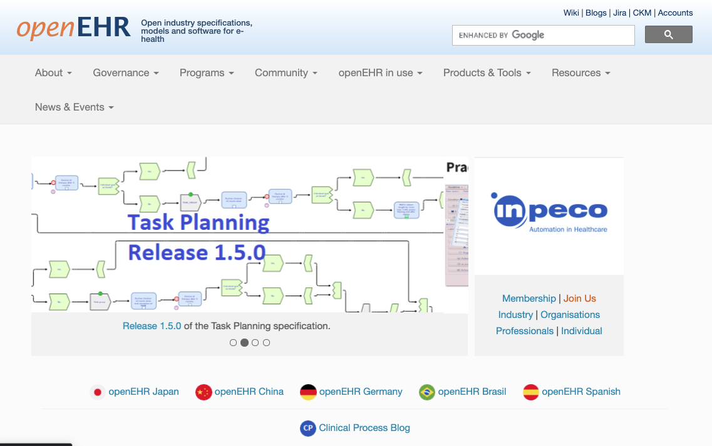
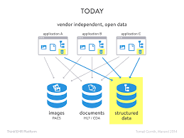
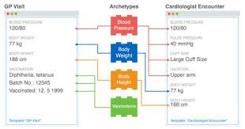

# Introduction

[openEHR](https://openehr.org) is a non-profit collaborative which promotes an open standards-based person-centric health and care records ecosystem, sometimes referred to as the 'open Platform' approach.

It envisages a world where patient/person health and care information is managed coherently in person-centric information stores, independent of the applications that read, write and query the at information. 

This is quite different from the current norm in healthcare, where thousands of individual applications hold siloed parts of the person's record, in siloed, normally proprietary, logical and physical data formats. Decades of effort have gone into trying to make this 'best-of-breed' approach interoperate, and whilst some positive progress is being made with HL7 FHIR, the limits of 'traditional interoperability are increasingly evident, as the complexity scales-up.

The openEHR community believes that traditional interoperability between siloed systems, whilst a necessary part of the story,  will not, by itself, deliver the kind of seamless and coherent integration between apps that otherwise has only been possible by acquiring a single, large-scale vendor system, with all of the disadvantages of technical and commercial lock-in that follow.

[This website](https://inidus.com/what-is-an-open-platform/) also gives a helpful overview of the 'open platform approach' which openEHR is designed to support.openehr-modellinfg

## The openEHR Clinical Data Repository (CDR)

openEHR offers an alternative 'third-way' where apps are increasingly built to work with person-centric, standards-based **'Clinical Data Repository'** (CDR) datastores instead of siloed, proprietary datastores. As well as helping promote much tighter integration, this should substantially reduce the barriers to new market entrants by allowing complex services to be provided on top of theCDR e.g integrations with national services such as national medication management.

openEHR does not itself create and publish CDR solutions or related applications, rather it provides a specification for the logical information model that underpins this key part of the technology stack. 

Critically the specification is completely agnostic with respect to the physical database or programming language, used by the CDR. From the perspective of the third-party app developer, they interact almost entirely with the CDR via a relatively small API, standardised data formats and a query language which is based on the logical models, not on the physical database/ schema employed. This allows competing internal CDR designs and technology choices to emerge without disturbing the application's interactions.

openEHR systems can be built on any programming language, OS platform and with any persistence solution - examples of SQL Server, Oracle, PostgreSQL, mongoDB and MumpsDB solutions exist. It is the responsibility of the back-end developer to map their chosen persistence solution to the openEHR logical information model and querying system.

## Splitting the logical information model ... 'two-level modelling'

One of the critical innovations in openEHR is the separation of the logical model into two parts.

### 1. The Reference Model (RM)

The RM is a typical technical logical model, published as a set of specifications and UML diagrams. It covers basic engineering requirements for a person-centric health and care record e.g datatypes, generic structures, data commit behaviours, versioning rules.

However, the RM, unlike most attempts to build healthcare logical models, has virtually no healthcare domain content - there are no Allergies, Medication or Diagnosis models. 

The definition and governance of those health and care concepts are left to the Domain modelling layer, however any domain models must be fully compliant with the RM, which is designed so that new and updated models can be incorporated without any re-engineering of the CDR.

This is a very critical part of the openEHR ecosystem, and sometimes hard to grasp both conceptually and practically, but it allows CDRs to be be able to handle *any* new healthcare concepts supplied by the domain modellers without requiring any database re-factoring. 

It also crucially changes the relationship between the CDR vendor and their customer, since the customer can control/update the data and data definitions within the CDR without any recourse to the vendor.

In essence this is not dissimilar to the kind of abstraction provided by Django or Ruby Active Objects, but is designed to work with the health domain, is much more extensible, and is designed to work in a completely language and
technology-neutral manner.

### 2. Domain Modelling (Archetypes and templates)

in openEHR, domain concepts like Allergy, Medication order, Procedure, Device are all defined and governed quite separately from the RM, primarily as shareable components known as Archetypes. 

In practice apps developers will normally work with aggregations of archetypes known as Templates, which represent a specific use-case e.g an application dialog to store a typical nursing 'vital signs' record , including checking the patient's blood pressure, pulse , temperature etc.

In order for a CDR to understand these information models, know how to persist and retrieve the information, the requisite templates and archetypes need simply to be registered with the CDR (normally via the CDR API). 

A thriving community based around exists to develop, publish and share internationally valid archetypes (which cover 70% of most projects) but there is no compulsion to use those archetypes. In that sense, openEHR as a modelling ecosystem more closely resembles the way that the open-source, distributed development community operates. At national, regional and implementer level there is much tighter governance, defining exactly which archetypes should be used.

### Confused!!

These ideas can seem like a stretch to technologists used to tight coupling of app-level information to underyling database products, and to modellers unfamiliar with the 2-level approach.

Possibly the best analogy is to the way that HTML/javascript is handled within browsers.

Essentially browser manufacturers implement the Domain Object Model (DOM) standard, which at very generic levels defines how to handle HTML, CSS and javascript but says nothing about specific content or theming. That is left to the web designer. In the openEHR world, the RM is equivalent to the HTML DOM.

openEHR archetypes can be thought of as being like CSS frameworks or React components, which 'graft' on to the DOM/RM at run-time, but are fully accessible to the programmer via the DOM/RM. 

If web developers use shared React components or CSS frameworks like Bootstrap or Material, they will achieve some standardisation of behaviour'. 

Similarly if openEHR developers use the international blood pressure archetype their systems will be interoperable for blood pressure, even if the underlying CDRs have a different vendor or technology.

## What does an openEHR-based system look like?

Logically the overall structure of an openEHR-based system is …

    Physical CDR
     Virtual CDR (optional)
      EHR 
       FOLDER
        COMPOSITION
         SECTION
          ENTRY
           CLUSTER
            ELEMENT
                name
                value
                
Every single piece of information recorded in an openEHR system follows this generic pattern ....

    Physical CDR   {Code4Health CDR}
     Virtual CDR     { My CDR Domain }
      EHR              { John Smith }
       FOLDER               { Cardiology pathway }
        COMPOSITION            { Outpatient review letter }
         SECTION                  { Investigations }
          ENTRY                      { Lab Test - U and E's }
           CLUSTER                      { Lab analyte }
            ELEMENT
                name                      { Urea }
                value                      { 4.3 mmols/l}

## CDR - Care Data Repository

All of the records within a single namespaced patient data repository.
In some environments, a single physical repository may be represented
as a number of independent virtual ‘domains’ each of which can be
regarded as a separate CDR.

## EHR - Electronic Health Record

An EHR is the top-level container of all clinical records for a single patient. All of those records are created as Compositions. When a new person/patient is registered with a CDR, a new EHR object is created, generally keyed on some kind of external identifier such as an NHS number, CHI number or other Medical Record identifier (MRI). 

## Folder (optional)

A high-level grouping of references to Compositions. A Composition may exist in multiple Folders. For example a patient with Diabetes who is admitted to hospital with a related problem may have any related Compositions tagged as being in both a 'Diabetes Folder' and a Folder specific to that admission.

## Composition

A Composition is a 'document-style' container for all clinical records. This equates to an Encounter, a Lab Report, a Discharge summary, a set of Nursing
Observations. 

All openEHR data is stored within the context of a Composition and always includes standard clinical/medico-legal context information such as clinical author details, encounter times etc.

Compositions are versioned and fully-audit trailed, so that previous
versions can always be retrieved, if they need to be updated or deleted.

The Composition is the container for structured/ coded data with
granular clinical statements such as procedure, blood pressure, allergy
expressed as an Entry, within which the leaf data is contained in
Elements e.g Systolic, Diastolic, Cuff size.

Although openEHR information is always stored in the context of a particular Composition, it can always be queried indpendently of that context.

### Composition versioning

openEHR systems handle versioning automatically. Any time a new version
of an existing document is committed to the system, its unique
compositionId identifier ‘version suffix’ is updated e.g

    798e27b1-f2e8-48c3-8ced-42d4d27d1db3::c4h.hopd.com::1

→

    798e27b1-f2e8-48c3-8ced-42d4d27d1db3::c4h.hopd.com::2

In normal operation only the most recent version of the composition is
returned by querying or composition retrieval.

## Section (optional)

Sections are optional structures which are used to break up complex
openEHR Compositions, grouping the Entries into high-level headings e.g.
in a Transfer of Care document, Sections might be represented as
Allergies, Problems, Procedures, Lab tests etc. Sections are convenient
for human consumption and navigation but should not be used to infer
meaning.

## Entry

In openEHR, all of key clinical content is carried within one of the 5
ENTRY sub-classes:

- Observation

- Evaluation

- Instruction

- Action

- Admin_entry

The Entry is the container for structured/ coded data via granular
`clinical statements` such as Procedure, Blood pressure, Allergy, within
which the leaf data is contained in Elements e.g Systolic, Diastolic,
Cuff size.

Entries are where most recognisable health and care concepts are modelled. THe sub-classes reflect slightly different generic requirements e.g Instructions and Actions carry extra attributes to facilitate the tracking of requests and orders and the activities that follow, whereas Observations often require more complex handling of time and person state. 

## Cluster (optional)

A Cluster is a branch-like sub-structure of an ENTRY which allow
ELEMENTS to be conveniently grouped and possibly repeated e.g in a Lab
Test archetype, data related to a single lab analysis result is grouped
within a Cluster to allow the whole pattern to be repeated

- Lab Test

- Lab Result (Cluster) - multiple

    - Result

    - Comment

- Datetime reported

- Status

In the construct above the cluster allows multiple Lab results to be
captured within a single Lab Test.

## Element

An Element is the leaf-node construct which is basically a name/value
pair with a defined datatype. The nature of the datatype determines the
exact structure of the Element.

